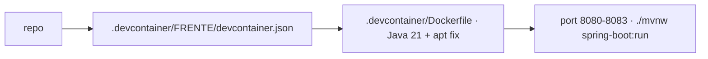

# 💻 .devcontainer

<!-- badges -->

> 🌐 [Português](README.md) · **English**

Reproducible development environment (VS Code / GitHub Codespaces) for
**arcanum-leque** — the *Leque de Vagas* backend (Challenge 02: Spring Boot API
with in-memory data).

---

## ⚙️ What is configured

| Item | Value |
| ---- | ----- |
| Base | `mcr.microsoft.com/devcontainers/java:1-21-bookworm` via `.devcontainer/Dockerfile` (pinned — the `:21` tag became trixie and breaks) |
| Java project | [`academic/src/`](../academic/src/) — `pom.xml` + `main/` (auto-detected) |
| Build | **Maven** via the `./mvnw` wrapper (the image already has Java 21) |
| Features | **none** — keeps it simple and breakage-proof |
| Docker | ❌ inside the container. The [`../docker/`](../docker/) stack runs on the host |
| Port | `8080`–`8083` (one per track) — no database, in-memory data |
| Extensions | Java Pack, Spring Boot Dev Pack, YAML, EditorConfig |

---

## 🧩 One dev container per track

**There is no root `devcontainer.json` in `.devcontainer/`** — only one per
track, each in its own folder, all built from the shared `.devcontainer/Dockerfile`.
Only `name`, the `FRENTE` var and the port change. The **folder names are in
English**:

| Config | Track | `FRENTE` | Port |
| ------ | ----- | -------- | ---- |
| `.devcontainer/job/` | Vaga | `vaga` | 8080 |
| `.devcontainer/company/` | Empresa | `empresa` | 8081 |
| `.devcontainer/person/` | Pessoa | `pessoa` | 8082 |
| `.devcontainer/statistics/` | Estatísticas | `estatisticas` | 8083 |

Distinct ports allow running tracks **in parallel**. In VS Code: palette →
*Dev Containers: Reopen in Container* → pick the track.

---

## ▶️ How to open

- **VS Code:** palette → *Dev Containers: Reopen in Container* → pick the track
- **GitHub Codespaces:** *Code ▸ Create codespace on…* → pick the config

---

## 🗺️ See also

- [`../README.en.md`](../README.en.md#-build) — build: **Maven**
- [`CLAUDE.md`](CLAUDE.md) (PT only) · [`../docker/README.en.md`](../docker/README.en.md)
