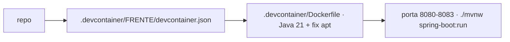

# 💻 .devcontainer

<!-- badges -->

> 🌐 **Português** · [English](README.en.md)

Ambiente de desenvolvimento reproduzível (VS Code / GitHub Codespaces) para o
**arcanum-leque** — backend do *Leque de Vagas* (Desafio 02: API Spring Boot com
dados em memória).

---

## ⚙️ O que vem configurado

| Item | Valor |
| ---- | ----- |
| Base | `mcr.microsoft.com/devcontainers/java:1-21-bookworm` via `.devcontainer/Dockerfile` (pinado — a tag `:21` virou trixie e quebra) |
| Projeto Java | [`academic/src/`](../academic/src/) — `pom.xml` + `main/` (detectado automaticamente) |
| Build | **Maven** via wrapper `./mvnw` (a imagem já traz Java 21) |
| Features | **nenhuma** — mantém simples e à prova de quebra |
| Docker | ❌ dentro do container. O stack de [`../docker/`](../docker/) roda no host |
| Porta | `8080`–`8083` (uma por frente) — sem banco, dados em memória |
| Extensões | Java Pack, Spring Boot Dev Pack, YAML, EditorConfig |

---

## 🧩 Um dev container por frente

**Não há `devcontainer.json` na raiz de `.devcontainer/`** — só um por frente,
cada um em sua pasta, todos partindo do `.devcontainer/Dockerfile` compartilhado.
Só mudam o `name`, a var `FRENTE` e a porta. As **pastas têm nome em inglês**:

| Config | Frente | `FRENTE` | Porta |
| ------ | ------ | -------- | ----- |
| `.devcontainer/job/` | Vaga | `vaga` | 8080 |
| `.devcontainer/company/` | Empresa | `empresa` | 8081 |
| `.devcontainer/person/` | Pessoa | `pessoa` | 8082 |
| `.devcontainer/statistics/` | Estatísticas | `estatisticas` | 8083 |

Portas distintas permitem rodar frentes **em paralelo**. No VS Code: paleta →
*Dev Containers: Reopen in Container* → escolher a frente.

---

## ▶️ Como abrir

- **VS Code:** paleta → *Dev Containers: Reopen in Container* → escolher a frente
- **GitHub Codespaces:** *Code ▸ Create codespace on…* → escolher a config

---

## 🗺️ Ver também

- [`../README.md`](../README.md#-build) — build: **Maven**
- [`CLAUDE.md`](CLAUDE.md) · [`../docker/README.md`](../docker/README.md)
