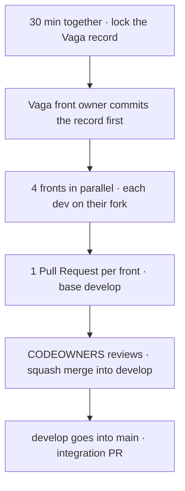
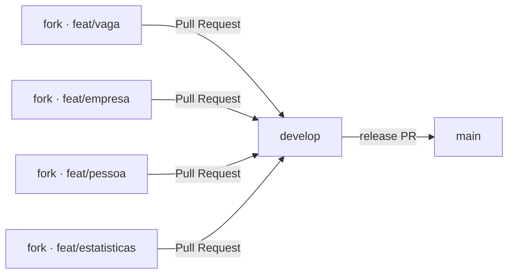
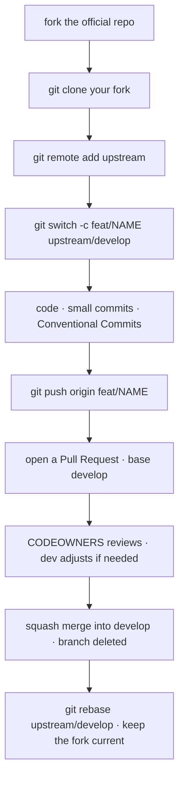

# 🤝 Contributing

<!-- badges -->


[](CONTRIBUTING.md)
[](CONTRIBUTING.en.md)

> 🌐 [Português](CONTRIBUTING.md) · **English**

Collaboration guide for **arcanum-leque** (Challenge 02 of the *Introduction to
Spring Boot* course).

---

## 🧭 Golden rule

**One person per front** (Vaga · Empresa · Pessoa · Estatísticas), **one PR per
front**, always through **fork + Pull Request** — nobody pushes directly to the
official repository.



---

## 🌳 Branch model

Lean GitFlow: only **two** long-lived branches in the official repo, plus one
working branch per front on each person's **fork**.



| Branch | Role | Who writes | How it lands |
| ------ | ---- | ---------- | ------------ |
| `main` | stable history / graded deliveries | nobody directly | PR from `develop` (Carlos only), tagged |
| `develop` | integration of the 4 fronts | nobody directly | PR from a `feat/*` (CODEOWNERS-approved) |
| `feat/<front>` | one person's work, **on their fork** | the front owner | becomes a PR to `develop` |

- Front branch: `feat/vaga`, `feat/empresa`, `feat/pessoa`, `feat/estatisticas`.
- Fixes: `fix/<short-topic>` · docs/infra: `docs/<topic>`, `chore/<topic>`.
  Always **kebab-case, no accents**.
- `main` and `develop` are **protected**: they require a PR + 1 CODEOWNERS
  approval + the template checklist.

---

## 🍴 Step by step (fork)



```bash
# 1. Fork on the website  → github.com/<you>/arcanum-leque

# 2. Clone YOUR fork
git clone git@github.com:<you>/arcanum-leque.git
cd arcanum-leque

# 3. Point the official repo as "upstream"
git remote add upstream git@github.com:CarlosNeto-dev/arcanum-leque.git
git fetch upstream

# 4. Create your front branch off develop
git switch -c feat/vaga upstream/develop

# 5. Work, committing in small steps
git add .
git commit -m "feat(vaga): add Vaga record"

# 6. Push to YOUR fork
git push -u origin feat/vaga

# 7. Open the PR on GitHub:
#    base:    CarlosNeto-dev/arcanum-leque  ·  develop
#    compare: <you>/arcanum-leque           ·  feat/vaga
```

Keep the fork current while the PR is open:

```bash
git fetch upstream
git switch feat/vaga
git rebase upstream/develop      # resolve conflicts locally
git push --force-with-lease      # updates the PR
```

---

## ✅ Before opening the PR (technical checklist)

- Constructor injection **only**, `final` field; **no `new`** between classes.
- Correct stereotypes (`@Repository` / `@Service` / `@RestController`);
  `record` without annotations.
- No business logic in the controller.
- Persistence = **in-memory list** (no database / JPA / DTO / validation).
- Domain names required by the statement stay in **Portuguese** (packages in
  English).
- `cd academic/src && ./mvnw test` passing; routes tested in Postman.
- Bilingual docs kept in pairs (`*.md` + `*.en.md`); new decisions in
  `academic/planning/` (PT **and** EN).

The PR uses the [default template](PULL_REQUEST_TEMPLATE.md) — fill in the checklist.

---

## ✍️ Conventions

### Commits — [Conventional Commits](https://www.conventionalcommits.org/)

```
<type>(<scope>): <imperative summary, lowercase, no trailing period>
```

- **type:** `feat` · `fix` · `docs` · `refactor` · `test` · `chore` · `build`
- **scope:** the front (`vaga`, `empresa`, `pessoa`, `estatisticas`) or the area
  (`docker`, `devcontainer`, `docs`, `github`)
- examples: `feat(estatisticas): aggregate jobs by area` ·
  `fix(empresa): fix duplicate slug` · `docs(readme): fork flow`

### Branches

`feat/<front>` · `fix/<topic>` · `docs/<topic>` · `chore/<topic>` — kebab-case,
no accents, short. One branch = one topic.

### Pull Requests

- Title follows the commit pattern.
- **Base is always `develop`** (never `main`).
- Small and focused: 1 PR per front.
- Template filled in + checklist ticked.
- Resolve every conversation before merge.
- Merge is **squash** — 1 clean commit per front on `develop`.

### Code

- Java: follow `.editorconfig` (format on save).
- **Classes and fields** in Portuguese, as in the statement (`VagaRepository`,
  `todas()`, `titulo`…); only the **package** is English (`br.edu.faculdade.job`…).
- Every human `.md` has a `*.md` + `*.en.md` pair updated together.

---

## 📌 Issues

Use the templates in [`ISSUE_TEMPLATE/`](ISSUE_TEMPLATE):
**Challenge 02 front**, **Bug** or **Idea / improvement**. One issue per front
helps track its PR.

---

## 🗺️ See also

- [`OVERVIEW.en.md`](OVERVIEW.en.md) · [`CODEOWNERS`](CODEOWNERS) ·
  [`PULL_REQUEST_TEMPLATE.md`](PULL_REQUEST_TEMPLATE.md)
- [`../README.en.md`](../README.en.md) — project overview
- [`../academic/planning/README.en.md`](../academic/planning/README.en.md) — team decisions
- [`../academic/references/`](../academic/references/README.en.md) — the rules behind the checklist
