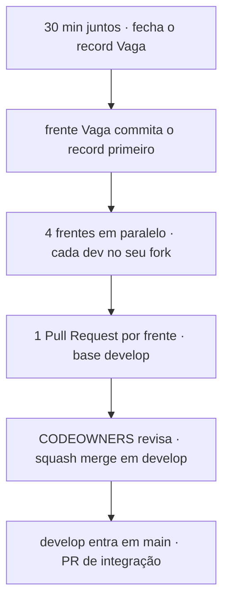
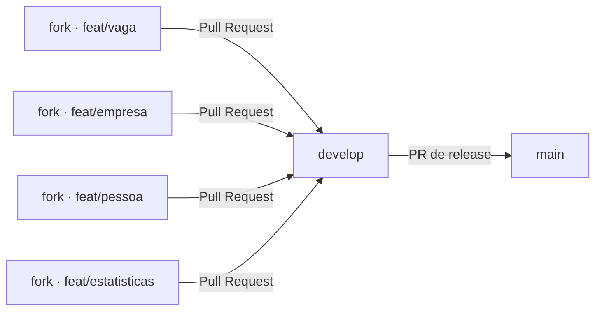
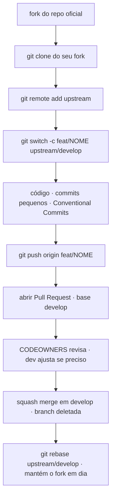

# 🤝 Contribuindo

<!-- badges -->


[](CONTRIBUTING.md)
[](CONTRIBUTING.en.md)

> 🌐 **Português** · [English](CONTRIBUTING.en.md)

Guia de colaboração para o **arcanum-leque** (Desafio 02 do curso *Introdução ao
Spring Boot*).

---

## 🧭 Regra de ouro

**Uma pessoa por frente** (Vaga · Empresa · Pessoa · Estatísticas), **um PR por
frente**, entrando sempre por **fork + Pull Request** — ninguém dá `push` direto
no repositório oficial.



---

## 🌳 Modelo de branches

Fluxo GitFlow enxuto: só **duas** branches de longa duração no repositório
oficial, e uma branch de trabalho por frente no **fork** de cada pessoa.



| Branch | Papel | Quem escreve | Como entra |
| ------ | ----- | ------------ | ---------- |
| `main` | histórico estável / entregas avaliadas | ninguém direto | PR de `develop` (só Carlos), com *tag* |
| `develop` | integração das 4 frentes | ninguém direto | PR de uma `feat/*` (aprovado pelo CODEOWNERS) |
| `feat/<frente>` | trabalho de uma pessoa, **no fork dela** | o dono da frente | vira PR para `develop` |

- Branch de frente: `feat/vaga`, `feat/empresa`, `feat/pessoa`,
  `feat/estatisticas`.
- Correções: `fix/<assunto-curto>` · docs/infra: `docs/<assunto>`,
  `chore/<assunto>`. Sempre **kebab-case, sem acento**.
- `main` e `develop` são **protegidas**: exigem PR + 1 aprovação do CODEOWNERS +
  checklist do template.

---

## 🍴 Fluxo passo a passo (fork)



```bash
# 1. Fork pelo site  → github.com/<voce>/arcanum-leque

# 2. Clone o SEU fork
git clone git@github.com:<voce>/arcanum-leque.git
cd arcanum-leque

# 3. Aponte o repositório oficial como "upstream"
git remote add upstream git@github.com:CarlosNeto-dev/arcanum-leque.git
git fetch upstream

# 4. Crie a branch da sua frente a partir de develop
git switch -c feat/vaga upstream/develop

# 5. Trabalhe, commitando aos poucos
git add .
git commit -m "feat(vaga): adiciona record Vaga"

# 6. Envie para o SEU fork
git push -u origin feat/vaga

# 7. Abra o PR no GitHub:
#    base:    CarlosNeto-dev/arcanum-leque  ·  develop
#    compare: <voce>/arcanum-leque          ·  feat/vaga
```

Manter o fork em dia enquanto o PR não é aceito:

```bash
git fetch upstream
git switch feat/vaga
git rebase upstream/develop      # resolve conflitos localmente
git push --force-with-lease      # atualiza o PR
```

---

## ✅ Antes de abrir o PR (checklist técnico)

- Injeção **só por construtor**, campo `final`; **nenhum `new`** entre classes.
- Estereótipos certos (`@Repository` / `@Service` / `@RestController`);
  `record` sem anotação.
- Sem regra de negócio no controller.
- Persistência = **lista em memória** (sem banco / JPA / DTO / validação).
- Nomes de domínio exigidos pelo enunciado em **português** (pacotes em inglês).
- `cd academic/src && ./mvnw test` passando; rotas testadas no Postman.
- Documentação bilíngue mantida em par (`*.md` + `*.en.md`); decisão nova em
  `academic/planning/` (PT **e** EN).

O PR usa o [template padrão](PULL_REQUEST_TEMPLATE.md) — preencha o checklist.

---

## ✍️ Padronizações

### Commits — [Conventional Commits](https://www.conventionalcommits.org/pt-br/)

```
<tipo>(<escopo>): <resumo no imperativo, minúsculo, sem ponto final>
```

- **tipo:** `feat` · `fix` · `docs` · `refactor` · `test` · `chore` · `build`
- **escopo:** a frente (`vaga`, `empresa`, `pessoa`, `estatisticas`) ou a área
  (`docker`, `devcontainer`, `docs`, `github`)
- exemplos: `feat(estatisticas): agrega vagas por área` ·
  `fix(empresa): corrige slug duplicado` · `docs(readme): fluxo de fork`

### Branches

`feat/<frente>` · `fix/<assunto>` · `docs/<assunto>` · `chore/<assunto>` —
kebab-case, sem acento, curtas. Uma branch = um assunto.

### Pull Requests

- Título no mesmo padrão do commit.
- **Base sempre `develop`** (nunca `main`).
- Pequeno e focado: 1 PR por frente.
- Template preenchido + checklist marcado.
- Resolver todas as conversas antes do merge.
- Merge é **squash** — 1 commit limpo por frente em `develop`.

### Código

- Java: seguir o `.editorconfig` (formatar ao salvar).
- **Classes e campos** em português, como no enunciado (`VagaRepository`,
  `todas()`, `titulo`…); só o **pacote** é inglês (`br.edu.faculdade.job`…).
- Todo `.md` humano tem par `*.md` + `*.en.md` atualizado junto.

---

## 📌 Issues

Use os templates em [`ISSUE_TEMPLATE/`](ISSUE_TEMPLATE):
**Frente do Desafio 02**, **Bug** ou **Ideia / melhoria**. Uma issue por frente
ajuda a rastrear o PR correspondente.

---

## 🗺️ Ver também

- [`OVERVIEW.md`](OVERVIEW.md) · [`CODEOWNERS`](CODEOWNERS) ·
  [`PULL_REQUEST_TEMPLATE.md`](PULL_REQUEST_TEMPLATE.md)
- [`../README.md`](../README.md) — visão geral do projeto
- [`../academic/planning/README.md`](../academic/planning/README.md) — decisões do time
- [`../academic/references/`](../academic/references/) — as regras por trás do checklist
