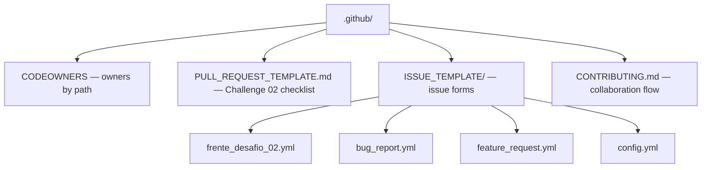

# ⚙️ .github

<!-- badges -->

> 🌐 [Português](OVERVIEW.md) · **English**

GitHub repository configuration for **arcanum-leque**: who reviews what, and the
issue / Pull Request templates.

> ℹ️ This file is named `OVERVIEW.md` (not `README.md`) on purpose: GitHub would
> show a `.github/README.md` on the repository home page **instead of** the root
> [`README.md`](../README.md).

---

## 📂 Contents

| File | Purpose |
| ---- | ------- |
| [`CODEOWNERS`](CODEOWNERS) | Automatic review owners by path. **Fallback:** `@CarlosNeto-dev`. Per-front lines are commented out until the team assigns owners and the packages exist. |
| [`PULL_REQUEST_TEMPLATE.md`](PULL_REQUEST_TEMPLATE.md) | Default PR body: front, challenge-rules checklist, how to test. |
| [`ISSUE_TEMPLATE/frente_desafio_02.yml`](ISSUE_TEMPLATE/frente_desafio_02.yml) | Task for one front (Vaga / Empresa / Pessoa / Estatísticas). |
| [`ISSUE_TEMPLATE/bug_report.yml`](ISSUE_TEMPLATE/bug_report.yml) | Bug report. |
| [`ISSUE_TEMPLATE/feature_request.yml`](ISSUE_TEMPLATE/feature_request.yml) | Idea / improvement. |
| [`ISSUE_TEMPLATE/config.yml`](ISSUE_TEMPLATE/config.yml) | Disables blank issues; links to the statement and docs. |
| [`CONTRIBUTING.en.md`](CONTRIBUTING.en.md) | **Fork + PR** flow, branch model (`main` · `develop` · `feat/*`), diagrams, Conventional Commits, checklist. |

> Issue form labels and bodies are written in Portuguese (the team's language).

---

## 🔑 CODEOWNERS

The last matching pattern wins. Today:

- `*` → `@CarlosNeto-dev` (fallback)
- `/.github/`, `/docker/`, `/.devcontainer/`, `/academic/` → `@CarlosNeto-dev`
- fronts (`/academic/src/main/java/br/edu/faculdade/<front>/`) → **commented
  out** — uncomment once owners are assigned (GitHub ignores non-existent
  user/path).

---

## 🗺️ See also

- [`../README.en.md`](../README.en.md) — project overview
- [`CONTRIBUTING.en.md`](CONTRIBUTING.en.md) · [`CLAUDE.md`](CLAUDE.md)
- [`../academic/references/04-desafio-02-leque-de-vagas.en.md`](../academic/references/04-desafio-02-leque-de-vagas.en.md) — the statement behind the templates
