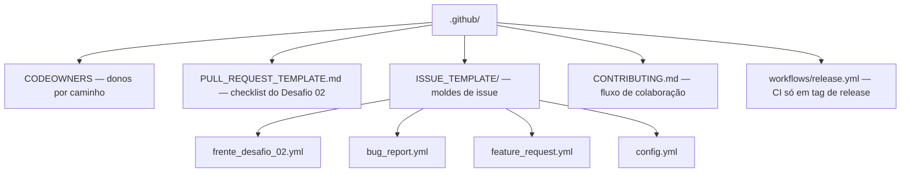

# ⚙️ .github

<!-- badges -->

> 🌐 **Português** · [English](OVERVIEW.en.md)

Configuração do repositório no GitHub para o **arcanum-leque**: quem revisa o quê,
e os moldes de issues e Pull Requests.

> ℹ️ Este arquivo se chama `OVERVIEW.md` (e não `README.md`) de propósito: o
> GitHub exibiria um `.github/README.md` na página inicial do repositório **no
> lugar** do [`README.md`](../README.md) da raiz.

---

## 📂 Conteúdo

| Arquivo | Para quê |
| ------- | -------- |
| [`CODEOWNERS`](CODEOWNERS) | Donos automáticos de revisão por caminho. **Fallback:** `@CarlosNeto-dev`. As linhas por frente ficam comentadas até o time definir responsáveis e os pacotes existirem. |
| [`PULL_REQUEST_TEMPLATE.md`](PULL_REQUEST_TEMPLATE.md) | Corpo padrão de PR: frente, checklist das regras do desafio, como testar. |
| [`ISSUE_TEMPLATE/frente_desafio_02.yml`](ISSUE_TEMPLATE/frente_desafio_02.yml) | Tarefa de uma frente (Vaga / Empresa / Pessoa / Estatísticas). |
| [`ISSUE_TEMPLATE/bug_report.yml`](ISSUE_TEMPLATE/bug_report.yml) | Relato de bug. |
| [`ISSUE_TEMPLATE/feature_request.yml`](ISSUE_TEMPLATE/feature_request.yml) | Ideia / melhoria. |
| [`ISSUE_TEMPLATE/config.yml`](ISSUE_TEMPLATE/config.yml) | Desliga issue em branco; links para enunciado e docs. |
| [`CONTRIBUTING.md`](CONTRIBUTING.md) | Fluxo **fork + PR**, modelo de branches (`main` · `develop` · `feat/*`), diagramas, Conventional Commits, checklist. |
| [`workflows/release.yml`](workflows/release.yml) | CI que roda **só** em push de tag `v*`: testes, agente de boas práticas (restrições duras do Desafio 02) e publicação do GitHub Release com o jar leve. |

---

## 🔑 CODEOWNERS

O último padrão que casa vence. Hoje:

- `*` → `@CarlosNeto-dev` (fallback)
- `/.github/`, `/docker/`, `/.devcontainer/`, `/academic/` → `@CarlosNeto-dev`
- frentes (`/academic/src/main/java/br/edu/faculdade/<frente>/`) → **comentadas**
  — descomentar ao definir os donos (GitHub ignora usuário/caminho inexistente).

---

## 🗺️ Ver também

- [`../README.md`](../README.md) — visão geral do projeto
- [`CONTRIBUTING.md`](CONTRIBUTING.md) · [`CLAUDE.md`](CLAUDE.md)
- [`../academic/references/04-desafio-02-leque-de-vagas.md`](../academic/references/04-desafio-02-leque-de-vagas.md) — enunciado que embasa os templates
