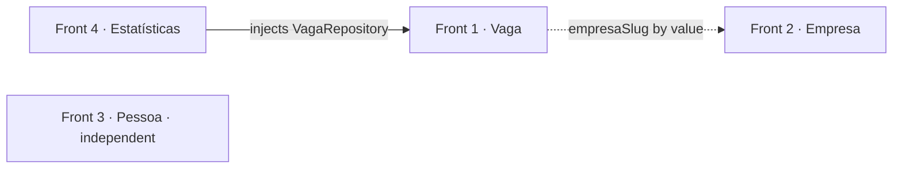
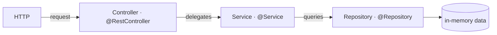
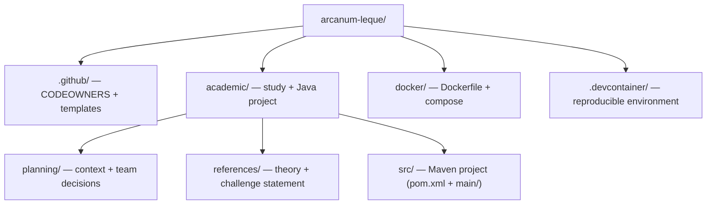
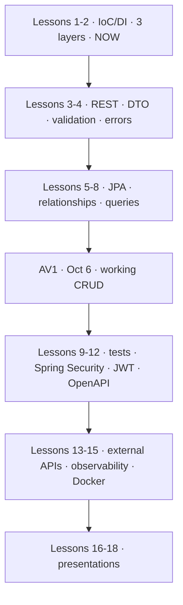

# 🗂️ arcanum-leque

<!-- badges -->


[](README.md)
[](README.en.md)

> 🌐 [Português](README.md) · **English**

> Backend (REST API) of **Leque de Vagas** ("Fan of Jobs") — a tech job board for
> **career changers**, connecting **companies that post openings** and **people
> who apply**.

Semester-long project of the **Introduction to Spring Boot** course (Um Leque de
Tecnologia). This phase implements **Challenge 02 — "The skeleton of Leque de
Vagas"** (lesson *Beans and Dependency Injection*): an API that answers from
**fixed in-memory data**, no database and no validation, but **already split into
`controller → service → repository`**.

🎓 Source: <https://aulas.umlequedetecnologia.com.br/cursos/introducao-spring-boot/aula-02-beans-e-injecao/desafio>

---

## 🎯 The product

| Aspect | Description |
| ------ | ----------- |
| **What it is** | A tech job catalog / marketplace (backend only in this track) |
| **Who it serves** | 2 sides: **companies** posting openings · **people** changing careers |
| **User profile** | Working-age adult (~25–45), already employed, **now moving into tech** — a domain newcomer, not a professional newcomer |
| **Job seniority** | Focus on intern / junior / mid-level |
| **Maturity** | Greenfield — born in this lesson "as three classes" |
| **Application (person↔job)** | Does **not exist** yet in this phase |

> ℹ️ There is no business narrative ("company X got volume Y…"). The scenario is
> pedagogical: simulate 4 devs working on different modules **in parallel**.

---

## 📊 By the numbers

| Metric | Value |
| ------ | ----- |
| Fronts | **4** |
| Layers per front | **3** |
| Domain records | **3** (Vaga, Empresa, Pessoa) |
| HTTP routes | **7** (2 + 2 + 2 + 1) |
| In-memory jobs / companies / people | ≥ **12** / ≥ **5** / ≥ **6** |
| Distinct areas / seniorities | ≥ **4** / ≥ **3** |
| Persistence | **in-memory list** (team decision — a real DB would be over-engineering) |
| Databases · DTOs · validations | **0** · **0** · **0** |
| Course lessons | **18** (through December) |
| Grading | 30% layers · 25% injection · 25% routes · 20% teamwork |

---

## 🧩 The 4 fronts

They are the domain entities of a job marketplace — not unrelated topics:

| Front | Role in the product | Routes |
| ----- | ------------------- | ------ |
| **Vaga** (Job) | the offer (core resource) | `GET /vagas` · `GET /vagas/{id}` |
| **Empresa** (Company) | who posts jobs | `GET /empresas` · `GET /empresas/{slug}` |
| **Pessoa** (Person) | the candidate | `GET /pessoas` · `GET /pessoas/{id}` |
| **Estatísticas** (Stats) | aggregated view of the catalog | `GET /estatisticas` |

> Field and route names stay in Portuguese because the challenge statement
> requires them verbatim.

### 🔗 Dependencies between fronts



- **Estatísticas → Vaga**: a **code** dependency (injects `VagaRepository`). Per
  the statement, only on Vaga — `/estatisticas` aggregates jobs only. Reading
  `Empresa`/`Pessoa` too is a possible extension, but it couples front 4 to all
  three.
- **Vaga ↔ Empresa**: **domain only**. In code, `empresaSlug` is a `String` —
  a **by-value** reference, not an object. `VagaService`/`VagaRepository` import
  nothing from Empresa. (Validating "does this slug exist?" is a later lesson.)
- **Pessoa**: fully independent in this phase (person↔job application does not
  exist yet).
- Front **Vaga commits the `record` first** (PR into `develop`); the others
  branch off `develop` with the record already there. Each dev: "I think through
  my own front, and speak up if I hit a dependency". Fork + PR flow in
  [`.github/CONTRIBUTING.en.md`](.github/CONTRIBUTING.en.md).

---

## 🧱 Three-layer architecture



The response travels back the same path: `Repository → Service → Controller → JSON`.

| Layer | Answers | Knows HTTP? | Knows where data comes from? |
| ----- | ------- | :---------: | :--------------------------: |
| Controller | "which route is this and what do I return?" | ✅ | ❌ |
| Service | "what is the rule?" | ❌ | ❌ |
| Repository | "where is the data?" | ❌ | ✅ |

📖 Details in [`academic/references/`](academic/references/README.en.md).

---

## 🗃️ Repository layout



| Folder | Purpose | Docs |
| ------ | ------- | ---- |
| [`.github/`](.github/) | CODEOWNERS, issue & PR templates, contributing guide | [OVERVIEW](.github/OVERVIEW.en.md) |
| [`academic/`](academic/) | Study material | [README](academic/README.en.md) |
| [`academic/src/`](academic/src/) | **Java project** — `pom.xml` (Maven), `./mvnw` wrapper, `main/java/br/edu/faculdade/{job,company,person,statistics}` | — |
| [`academic/planning/`](academic/planning/) | Product context, audience and team decisions | [README](academic/planning/README.en.md) |
| [`academic/references/`](academic/references/) | Theory (IoC/DI, stereotypes, 3 layers) + challenge statement | [README](academic/references/README.en.md) |
| [`docker/`](docker/) | Containerization: multi-stage `Dockerfile` + `docker-compose` (`web`/`app`/`test`/`prod`) | [README](docker/README.en.md) |
| [`.devcontainer/`](.devcontainer/) | Dev container (VS Code / Codespaces) — one per track (`job/`, `company/`, `person/`, `statistics/`) | [README](.devcontainer/README.en.md) |

---

## 🛣️ Course roadmap



Today's skeleton becomes, over the semester: real CRUD → database → validation →
authentication → documentation → container.

---

## 🚧 Build

**Maven** (via the `./mvnw` wrapper) — team decision. The Java project lives in
[`academic/src/`](academic/src/) (`pom.xml` + `main/`).

```bash
cd academic/src
./mvnw spring-boot:run           # starts the API on port 8080
./mvnw test                      # runs the tests
./mvnw -Plight clean package     # "light" build: AOT + classes without debug symbols + no DevTools

# Docker (see docker/README.en.md)
cd docker
docker compose up --build web    # dev + hot reload + remote debug :5005
docker compose up --build prod   # minimal image (jlink) + healthcheck :8090
```

---

## 👥 Team (one person per front)

| Front | Owner | Branch (on the fork) |
| ----- | ----- | -------------------- |
| Vaga | _TBD_ | `feat/vaga` |
| Empresa | _TBD_ | `feat/empresa` |
| Pessoa | _TBD_ | `feat/pessoa` |
| Estatísticas | _TBD_ | `feat/estatisticas` |

Work happens via **fork + Pull Request** into `develop` — step by step, diagrams
and conventions in [`.github/CONTRIBUTING.en.md`](.github/CONTRIBUTING.en.md).

---

## 📌 Current state

Folder structure, documentation and the **Maven skeleton** in `academic/src/`:
`pom.xml`, the `./mvnw` wrapper, `Application.java` and the 4 empty track
packages (`job/`, `company/`, `person/`, `statistics/`). **The track classes**
(controller/service/repository/record) **have not been written yet** — each
track owner writes their own. A throwaway `SmokeController` (`GET /smoke`) is
there only to validate the stack; it goes away when the Vaga track starts.

🐳 **Docker + dev container validated end to end:** `web`/`app`/`test`/`prod`
boot and answer HTTP; `prod` reports `healthy`.
