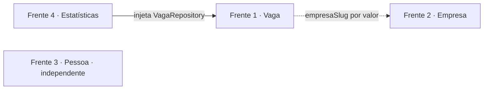
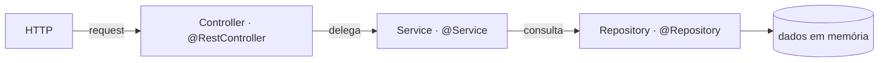
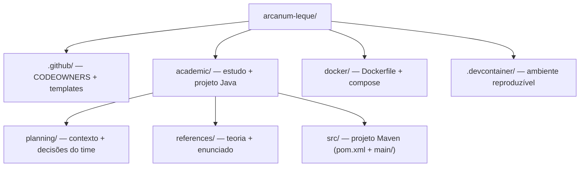
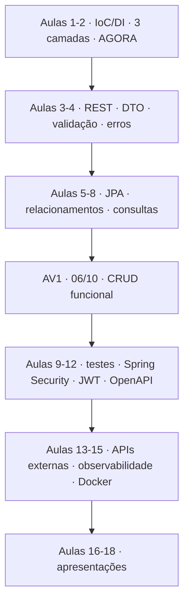

# 🗂️ arcanum-leque

<!-- badges -->


[](README.md)
[](README.en.md)

> 🌐 **Português** · [English](README.en.md)

> Backend (API REST) do **Leque de Vagas** — uma plataforma de vagas de
> tecnologia para **profissionais em transição de carreira**, conectando
> **empresas que publicam vagas** e **pessoas que se candidatam**.

Projeto-fio-condutor do curso **Introdução ao Spring Boot** (Um Leque de
Tecnologia). Esta fase implementa o **Desafio 02 — "O esqueleto do Leque de
Vagas"** (aula *Beans e Injeção de Dependência*): uma API que responde com
**dados fixos em memória**, sem banco e sem validação, mas **já dividida em
`controller → service → repository`**.

🎓 Fonte: <https://aulas.umlequedetecnologia.com.br/cursos/introducao-spring-boot/aula-02-beans-e-injecao/desafio>

---

## 🎯 O produto

| Aspecto | Descrição |
| ------- | --------- |
| **O que é** | Catálogo/marketplace de vagas de tecnologia (só backend nesta trilha) |
| **Para quem** | 2 pontas: **empresas** publicadoras · **pessoas** em transição de carreira |
| **Perfil do usuário** | Adulto em idade ativa (~25–45), já no mercado, **entrando agora em tech** — leigo no domínio, não leigo profissionalmente |
| **Senioridade das vagas** | Foco em estágio / júnior / pleno |
| **Maturidade** | Greenfield — nasce nesta aula "como três classes" |
| **Candidatura (pessoa↔vaga)** | Ainda **não existe** nesta fase |

> ℹ️ Não há enredo de negócio ("empresa X recebeu volume Y…"). O cenário é
> pedagógico: simular 4 devs tocando módulos diferentes **em paralelo**.

---

## 📊 Por números

| Métrica | Valor |
| ------- | ----- |
| Frentes | **4** |
| Camadas por frente | **3** |
| Records de domínio | **3** (Vaga, Empresa, Pessoa) |
| Rotas HTTP | **7** (2 + 2 + 2 + 1) |
| Vagas / Empresas / Pessoas em memória | ≥ **12** / ≥ **5** / ≥ **6** |
| Áreas / senioridades distintas | ≥ **4** / ≥ **3** |
| Persistência | **lista em memória** (decisão do time — banco real seria over-engineering) |
| Bancos · DTOs · validações | **0** · **0** · **0** |
| Aulas no curso | **18** (até dezembro) |
| Avaliação | 30% camadas · 25% injeção · 25% rotas · 20% equipe |

---

## 🧩 As 4 frentes

São as entidades de domínio de um marketplace de vagas — não assuntos soltos:

| Frente | Papel no produto | Rotas |
| ------ | ---------------- | ----- |
| **Vaga** | a oferta (recurso central) | `GET /vagas` · `GET /vagas/{id}` |
| **Empresa** | quem publica vagas | `GET /empresas` · `GET /empresas/{slug}` |
| **Pessoa** | o candidato | `GET /pessoas` · `GET /pessoas/{id}` |
| **Estatísticas** | visão agregada do catálogo | `GET /estatisticas` |

### 🔗 Dependências entre as frentes



- **Estatísticas → Vaga**: dependência de **código** (injeta `VagaRepository`).
  Pelo enunciado, só de Vaga — o `/estatisticas` agrega apenas vagas. Ler também
  `Empresa`/`Pessoa` é extensão possível, mas acopla a frente 4 às três.
- **Vaga ↔ Empresa**: só **domínio**. No código, `empresaSlug` é uma `String` —
  referência **por valor**, não por objeto. `VagaService`/`VagaRepository` não
  importam nada de Empresa. (A validação "esse slug existe?" é de aula futura.)
- **Pessoa**: totalmente independente nesta fase (candidatura pessoa↔vaga ainda
  não existe).
- A frente **Vaga commita o `record` primeiro** (PR para `develop`); as outras
  partem de `develop` já com o record. Cada dev: "penso na minha frente, aviso se
  esbarrar numa dependência". Fluxo de fork + PR em
  [`.github/CONTRIBUTING.md`](.github/CONTRIBUTING.md).

---

## 🧱 Arquitetura em 3 camadas



A resposta volta pelo mesmo caminho: `Repository → Service → Controller → JSON`.

| Camada | Responde | Sabe de HTTP? | Sabe da origem dos dados? |
| ------ | -------- | :-----------: | :-----------------------: |
| Controller | "que rota é e o que devolvo?" | ✅ | ❌ |
| Service | "qual é a regra?" | ❌ | ❌ |
| Repository | "cadê os dados?" | ❌ | ✅ |

📖 Detalhes em [`academic/references/`](academic/references/).

---

## 🗃️ Estrutura do repositório



| Pasta | Para quê | Docs |
| ----- | -------- | ---- |
| [`.github/`](.github/) | CODEOWNERS, templates de issue e PR, guia de contribuição | [OVERVIEW](.github/OVERVIEW.md) |
| [`academic/`](academic/) | Material de estudo | [README](academic/README.md) |
| [`academic/src/`](academic/src/) | **Projeto Java** — `pom.xml` (Maven), wrapper `./mvnw`, `main/java/br/edu/faculdade/{job,company,person,statistics}` | — |
| [`academic/planning/`](academic/planning/) | Contexto do produto, público-alvo e decisões do time | [README](academic/planning/README.md) |
| [`academic/references/`](academic/references/) | Teoria (IoC/DI, estereótipos, 3 camadas) + enunciado do desafio | [README](academic/references/README.md) |
| [`docker/`](docker/) | Containerização: `Dockerfile` multi-stage + `docker-compose` (`web`/`app`/`test`/`prod`) | [README](docker/README.md) |
| [`.devcontainer/`](.devcontainer/) | Dev container (VS Code / Codespaces) — um por frente (`job/`, `company/`, `person/`, `statistics/`) | [README](.devcontainer/README.md) |

---

## 🛣️ Roadmap do curso



O esqueleto de agora vira, ao longo do semestre: CRUD real → banco → validação →
autenticação → documentação → container.

---

## 🚧 Build

**Maven** (via wrapper `./mvnw`) — decisão do time. O projeto Java fica em
[`academic/src/`](academic/src/) (`pom.xml` + `main/`).

```bash
cd academic/src
./mvnw spring-boot:run           # sobe a API na porta 8080
./mvnw test                      # roda os testes
./mvnw -Plight clean package     # build "leve": AOT + classes sem símbolos de debug + sem DevTools

# Docker (ver docker/README.md)
cd docker
docker compose up --build web    # dev + hot reload + debug remoto :5005
docker compose up --build prod   # imagem mínima (jlink) + healthcheck :8090
```

---

## 👥 Equipe (uma pessoa por frente)

| Frente | Responsável | Branch (no fork) |
| ------ | ----------- | ---------------- |
| Vaga | _a definir_ | `feat/vaga` |
| Empresa | _a definir_ | `feat/empresa` |
| Pessoa | _a definir_ | `feat/pessoa` |
| Estatísticas | _a definir_ | `feat/estatisticas` |

Trabalho via **fork + Pull Request** para `develop` — passo a passo, diagramas e
padronizações em [`.github/CONTRIBUTING.md`](.github/CONTRIBUTING.md).

---

## 📌 Estado atual

Estrutura de pastas, documentação e o **esqueleto Maven** em `academic/src/`:
`pom.xml`, wrapper `./mvnw`, `Application.java` e os 4 pacotes de frente vazios
(`job/`, `company/`, `person/`, `statistics/`). **As classes das frentes**
(controller/service/repository/record) **ainda não foram escritas** — cada dono
de frente escreve a sua. Um `SmokeController` provisório (rota `GET /smoke`)
existe só para validar a stack; sai quando a frente Vaga começar.

🐳 **Docker + dev container validados de ponta a ponta:** `web`/`app`/`test`/`prod`
sobem e respondem HTTP; `prod` fica `healthy`.
