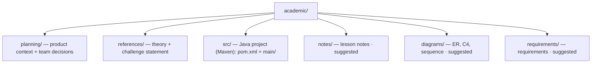

# 📚 academic

<!-- badges -->

> 🌐 [Português](README.md) · **English**

Study and coursework material for **arcanum-leque** — project of the
*Introduction to Spring Boot* course (Um Leque de Tecnologia).

The project is born from **Challenge 02 — "The skeleton of Leque de Vagas"**
(lesson *Beans and Dependency Injection*): a Spring Boot API with four parallel
fronts (Vaga, Empresa, Pessoa, Estatísticas), each following the
`controller → service → repository` pattern, with **in-memory data**.

> 🐳 The Docker build uses the repo root as context, but the (single) root
> `.dockerignore` lets in **only `academic/src/`** — the rest of `academic/` and
> the other directories stay out.

---

## 🧭 Layout

> `notes/`, `diagrams/` and `requirements/` are organization suggestions — create
> them as needed.

### `src/` — the Java project

Maven root (non-standard layout: `pom.xml` + `main/` + `test/`, without the
intermediate `src/`). **Maven** build via the `./mvnw` wrapper, base package
`br.edu.faculdade`, tracks under
`main/java/br/edu/faculdade/{job,company,person,statistics}`.
`./mvnw -Plight clean package` produces a "light" jar (AOT, no debug symbols, no
DevTools). Container details in [`../docker/README.en.md`](../docker/README.en.md).

---

## 🧭 planning/

| File | Topic |
| ---- | ----- |
| [`contexto-e-publico-alvo.en.md`](planning/contexto-e-publico-alvo.en.md) | Theme, fronts×theme relation, audience, age range, personas, hard rules and **team decisions** |

➡️ [`planning/README.en.md`](planning/README.en.md)

---

## 📖 references/

| # | File | Topic |
| - | ---- | ----- |
| 01 | [`01-ioc-e-injecao-de-dependencia.en.md`](references/01-ioc-e-injecao-de-dependencia.en.md) | Inversion of Control, beans and injection types |
| 02 | [`02-estereotipos-spring.en.md`](references/02-estereotipos-spring.en.md) | `@Component`, `@Service`, `@Repository`, `@RestController`, `@Bean` |
| 03 | [`03-arquitetura-em-tres-camadas.en.md`](references/03-arquitetura-em-tres-camadas.en.md) | The `controller → service → repository` pattern |
| 04 | [`04-desafio-02-leque-de-vagas.en.md`](references/04-desafio-02-leque-de-vagas.en.md) | Full statement of Challenge 02 |

➡️ Detailed index in [`references/README.en.md`](references/README.en.md).

---

## 🎓 The course at a glance

| Item | Value |
| ---- | ----- |
| Lessons | 18 (through December) |
| Milestone | **AV1 · Oct 6** — working CRUD |
| Prerequisite | OOP with Java |
| Track | Plain Java → production-ready REST API (JPA, validation, Security/JWT, tests, OpenAPI, Docker) |

🔗 Source: <https://aulas.umlequedetecnologia.com.br/cursos/introducao-spring-boot/aula-02-beans-e-injecao/desafio>

---

## 🗺️ See also

- [`../README.en.md`](../README.en.md) — product overview
- [`planning/README.en.md`](planning/README.en.md) · [`references/README.en.md`](references/README.en.md)
- [`CLAUDE.md`](CLAUDE.md) — agent guidance for this directory (PT only)
