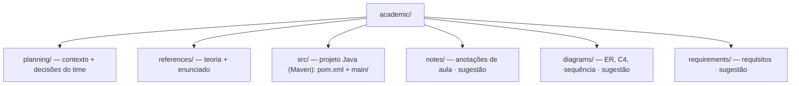

# 📚 academic

<!-- badges -->

> 🌐 **Português** · [English](README.en.md)

Material acadêmico e de estudo do **arcanum-leque** — projeto do curso
*Introdução ao Spring Boot* (Um Leque de Tecnologia).

O projeto nasce do **Desafio 02 — "O esqueleto do Leque de Vagas"** (aula
*Beans e Injeção de Dependência*): uma API Spring Boot com quatro frentes
paralelas (Vaga, Empresa, Pessoa, Estatísticas), cada uma no padrão
`controller → service → repository`, com **dados em memória**.

> 🐳 O build Docker usa a raiz do repo como contexto, mas o `.dockerignore`
> (único, na raiz) deixa entrar **só `academic/src/`** — o resto de `academic/`
> e os outros diretórios ficam fora.

---

## 🧭 Estrutura

> `notes/`, `diagrams/` e `requirements/` são sugestões de organização — crie
> conforme precisar.

### `src/` — o projeto Java

Raiz Maven (layout não-padrão: `pom.xml` + `main/` + `test/`, sem o `src/`
intermediário). Build **Maven** via wrapper `./mvnw`, pacote base
`br.edu.faculdade`, frentes em `main/java/br/edu/faculdade/{job,company,person,statistics}`.
`./mvnw -Plight clean package` gera um jar "leve" (AOT, sem símbolos de debug,
sem DevTools). Detalhes de container em [`../docker/README.md`](../docker/README.md).

---

## 🧭 planning/

| Arquivo | Assunto |
| ------- | ------- |
| [`contexto-e-publico-alvo.md`](planning/contexto-e-publico-alvo.md) | Tema, relação frentes×tema, público-alvo, faixa etária, personas, regras duras e **decisões do time** |

➡️ [`planning/README.md`](planning/README.md)

---

## 📖 references/

| # | Arquivo | Assunto |
| - | ------- | ------- |
| 01 | [`01-ioc-e-injecao-de-dependencia.md`](references/01-ioc-e-injecao-de-dependencia.md) | Inversão de Controle, beans e tipos de injeção |
| 02 | [`02-estereotipos-spring.md`](references/02-estereotipos-spring.md) | `@Component`, `@Service`, `@Repository`, `@RestController`, `@Bean` |
| 03 | [`03-arquitetura-em-tres-camadas.md`](references/03-arquitetura-em-tres-camadas.md) | Padrão `controller → service → repository` |
| 04 | [`04-desafio-02-leque-de-vagas.md`](references/04-desafio-02-leque-de-vagas.md) | Enunciado completo do Desafio 02 |

➡️ Índice detalhado em [`references/README.md`](references/README.md).

---

## 🎓 O curso em uma olhada

| Item | Valor |
| ---- | ----- |
| Aulas | 18 (até dezembro) |
| Marco | **AV1 · 06/10** — CRUD funcional |
| Pré-requisito | POO com Java |
| Trilha | Java puro → API REST pronta pra produção (JPA, validação, Security/JWT, testes, OpenAPI, Docker) |

🔗 Fonte: <https://aulas.umlequedetecnologia.com.br/cursos/introducao-spring-boot/aula-02-beans-e-injecao/desafio>

---

## 🗺️ Ver também

- [`../README.md`](../README.md) — visão geral do produto
- [`planning/README.md`](planning/README.md) · [`references/README.md`](references/README.md)
- [`CLAUDE.md`](CLAUDE.md) — orientações para agentes neste diretório
