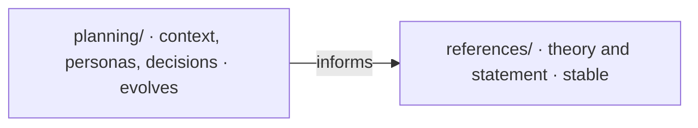

# 🧭 academic/planning

<!-- badges -->

> 🌐 [Português](README.md) · **English**

Discovery and team decisions **before coding** — the product understanding, the
questions raised, and what was agreed.

---

## 🧭 planning/ vs references/

| | `planning/` | `references/` |
| --- | --- | --- |
| **What it is** | team understanding and agreements | theory + statement |
| **Changes when** | every conversation/decision | almost never |
| **Authority** | team decisions beat assumptions | source of truth for architecture |

---

## 📄 Documents

| File | Topic |
| ---- | ----- |
| [`contexto-e-publico-alvo.en.md`](contexto-e-publico-alvo.en.md) | Project theme, fronts↔theme relation, absence of a business narrative, audience, age range, layperson vs. technical, personas, hard rules and **team decisions** |

---

## ✅ Decision log

| # | Decision | Rationale | Impact |
| - | -------- | --------- | ------ |
| D1 | **Persistence = in-memory list** (no database) | ~12 jobs, 5 companies, 6 people, fixed data — a real DB would be over-engineering | `docker/` and `.devcontainer/` bring up no DBMS; only the repository knows the data source |
| D2 | **`/estatisticas` aggregates jobs only** | follows the statement; avoids coupling front 4 to the other three | `EstatisticasService` injects only `VagaRepository` |
| D3 | **Vaga ↔ Empresa is a domain link, not a code link** | `empresaSlug` is a `String` (by value) → fronts 1 and 2 progress in parallel | no `import` between fronts; slug validation deferred to a later lesson |
| D4 | **Build = Maven** (`./mvnw` wrapper) | single tool, Spring Initializr default; avoids maintaining two build paths | `docker/` and `.devcontainer/` use Maven only; no Gradle in the project |
| D5 | **Java project in `academic/src/`**, base package `br.edu.faculdade`, track packages in **English** (`job`/`company`/`person`/`statistics`) | structure set up by the repo owner; only the **package** is English — classes and fields keep the statement's PT (`VagaRepository`, `todas()`, …) | the single root `.dockerignore` keeps only `academic/src/` in the context; non-standard Maven layout (`pom.xml` + `main/`) via `<sourceDirectory>` |
| D6 | **"Light" build = `light` profile** (`./mvnw -Plight`) + **jlink** in the production stage | request: "turn everything into a lighter Java file" | AOT + classes without debug symbols + no DevTools; production image with a tailored JRE |
| D7 | **Flow = fork + PR, lean GitFlow** (`main` · `develop` · `feat/<front>`) | small squad, single merge owner; `main` always gradable | contributors fork, PR into `develop`; `develop → main` via Carlos's PR. Details in [`../../.github/CONTRIBUTING.en.md`](../../.github/CONTRIBUTING.en.md) |

---

## 🗺️ See also

- [`../README.en.md`](../README.en.md) · [`../../README.en.md`](../../README.en.md)
- [`../references/README.en.md`](../references/README.en.md) — theory and statement
- [`CLAUDE.md`](CLAUDE.md) (PT only)
