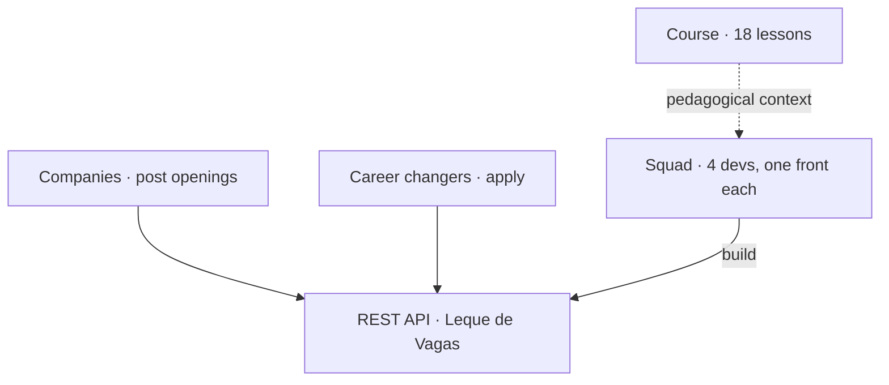

# Product context and audience

<!-- badges -->

> 🌐 [Português](contexto-e-publico-alvo.md) · **English**

> Consolidation of the understanding questions asked **before coding**, answered
> from the course website.
>
> - Challenge 02: <https://aulas.umlequedetecnologia.com.br/cursos/introducao-spring-boot/aula-02-beans-e-injecao/desafio>
> - Course: <https://aulas.umlequedetecnologia.com.br/cursos/introducao-spring-boot>

---

## 🗺️ Context map

---

## Overall theme

**Introduction to Spring Boot** course (NickDev / Um Leque de Tecnologia). The
semester-long project is **"Leque de Vagas"** ("Fan of Jobs"): a **tech job board
for career changers**. Students build **the backend only** (REST API) — no
frontend is in scope.

**Challenge 02** is the *first step*: build the **skeleton** — an API that
answers from **fixed in-memory data** (no database, no validation, no DTO, no
error handling), but **already split into `controller → service → repository`**.
Stated pedagogical goal: *"the right design from day one, because it is much
cheaper than fixing it later"*.

## How the fronts relate to the theme

They are not 4 unrelated topics — they are the **domain entities of a job
marketplace**:

| Front | Role in the product | Analogy |
| ----- | ------------------- | ------- |
| Vaga (Job) | the offer (core resource) | the "posting" on the board |
| Empresa (Company) | who offers / posts jobs | who pins the posting |
| Pessoa (Person) | who demands (the candidate) | who reads the board |
| Estatísticas (Stats) | aggregated view of the catalog | the "board summary" (how many postings, of what kind) |

The **application** (Person↔Job link) does **not exist** yet in this phase — it
is what would turn the board into a transaction.

## Is there a business narrative?

**No.** The page has no story like *"company X gets volume Y and hired a squad"*.
There is a product (a tech job board for career changers) and the team is the
backend, building from scratch, incrementally. The "scenario" is **pedagogical**:
simulate 4 devs on different modules, in parallel, with individual commits.

## Audience

Of the **product** — two connected sides:

### 🏢 Persona A — Posting company
- Wants to advertise openings and be found by candidates.
- Identified by a stable `slug` (e.g. `aurora-tech`).
- This phase: read-only (`GET /empresas`).

### 🧑‍💻 Persona B — Career changer
- An adult already in the workforce, **now moving into tech**.
- Looks for jobs matching their area of interest and seniority.
- Focus on **intern / junior / mid-level**.
- This phase: read-only (`GET /vagas`, `GET /pessoas`).

It is a **public two-sided platform** (marketplace), **not** an internal tool for
a company owner nor a technical dashboard. It is not a single-persona product.

Of the **course**: beginners with a solid OOP-with-Java background.

## Client age range

The site gives **no explicit age range**. The only signal is *"career changers"*,
which implies **working-age adults with prior professional experience** moving
into tech. Likely profile: **~25–45 years old, already employed**. Not students
straight out of high school, nor an elderly audience.

## Layperson or technical?

**A layperson in the tech domain / tech job market** (just entering it), but
**not a professional layperson** (already working). Job seniority focuses on
**intern / junior / mid-level** — little senior presence.

In this phase (lesson 02) there is **no end user and no UI**: the API consumer is
another dev / Postman.

## Rules that break the system if violated

| # | Rule | If broken |
| - | ---- | --------- |
| 1 | **A job's `empresaSlug` == a company's `slug`** (identical string, e.g. `"aurora-tech"`) | breaks the integration planned for lesson 06 |
| 2 | **Stats depends on the Vaga front's list** — *"to count, it needs the list the Vaga front will write"* | front 4 does not run; hence the `record Vaga` + `VagaRepository.todas()` ship first |
| 3 | **No password in this phase** (intentional until lesson 10, Spring Security) | adding it now violates the rule |
| 4 | Constructor injection only · no `new` between classes · no rule in the controller · `record` without annotations · one person per front | breaks the **grade** (not the runtime) |

## Other points

- **Greenfield**: the project is born this lesson "as three classes" and grows
  into an authenticated, documented, containerized API.
- **Names required in Portuguese** by the statement (see
  [`../references/04-desafio-02-leque-de-vagas.en.md`](../references/04-desafio-02-leque-de-vagas.en.md)).
- **Build**: **Maven** (`./mvnw` wrapper) — team decision (see `README.en.md`, D4).

## Team decisions

- **Persistence = in-memory list.** There will be no database. For the project's
  volume (~12 jobs, 5 companies, 6 people, fixed data), a real DB is
  over-engineering. Only the repository knows the data source.
- **`/estatisticas` follows the statement**: aggregates jobs only
  (`EstatisticasService` injects only `VagaRepository`). Extending it to
  company/person metrics is an optional evolution — it would couple front 4 to
  the other three.
- **Vaga ↔ Empresa is not a code dependency**: `empresaSlug` is a `String`
  (by-value reference). Only Estatísticas → Vaga is code coupling.
- **Build = Maven.** Single tool (no Gradle); `docker/` and `.devcontainer/`
  already assume `./mvnw`.
- **Java project in `academic/src/`** (base package `br.edu.faculdade`; front
  **packages** in English: `job`, `company`, `person`, `statistics`).
  Non-standard Maven layout (`pom.xml` + `main/`). **Classes and fields follow
  the statement, in PT** (`VagaRepository`, `todas()`, …) — only the package is
  English.
- **"Light" build:** `./mvnw -Plight` (AOT + classes without debug symbols + no
  DevTools) and, in the container, a tailored JRE via `jlink`.
- **One dev container per track:**
  `.devcontainer/{job,company,person,statistics}/` — same image, ports 8080–8083
  for parallel flows.
- **Workflow:** fork + Pull Request, lean GitFlow — `main` (stable) · `develop`
  (integration) · `feat/<front>` on each person's fork. Only Carlos merges. See
  [`../../.github/CONTRIBUTING.en.md`](../../.github/CONTRIBUTING.en.md).

## See also

- [`README.en.md`](README.en.md) — decision log
- [`../references/03-arquitetura-em-tres-camadas.en.md`](../references/03-arquitetura-em-tres-camadas.en.md)
- [`../references/04-desafio-02-leque-de-vagas.en.md`](../references/04-desafio-02-leque-de-vagas.en.md)
- [`../../README.en.md`](../../README.en.md)
