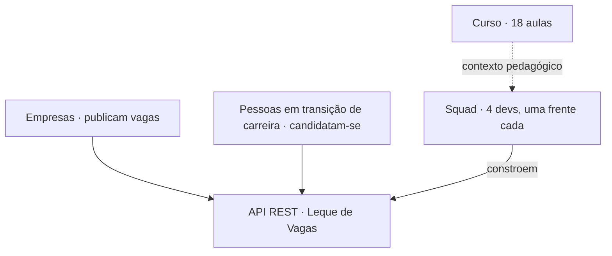

# Contexto do produto e público-alvo

<!-- badges -->

> 🌐 **Português** · [English](contexto-e-publico-alvo.en.md)

> Consolidação das perguntas de entendimento feitas **antes de codar**,
> respondidas a partir do site do curso.
>
> - Desafio 02: <https://aulas.umlequedetecnologia.com.br/cursos/introducao-spring-boot/aula-02-beans-e-injecao/desafio>
> - Curso: <https://aulas.umlequedetecnologia.com.br/cursos/introducao-spring-boot>

---

## 🗺️ Mapa de contexto

---

## Tema geral

Curso **Introdução ao Spring Boot** (NickDev / Um Leque de Tecnologia). O projeto
que atravessa o semestre é o **"Leque de Vagas"**: uma **plataforma de vagas de
tecnologia para profissionais em transição de carreira**. Os alunos constroem
**apenas o backend** (API REST) — não há front-end no escopo.

O **Desafio 02** é o *primeiro passo*: montar o **esqueleto** — uma API que
responde com **dados fixos em memória** (sem banco, sem validação, sem DTO, sem
tratamento de erro), mas **já dividida em `controller → service → repository`**.
Objetivo pedagógico declarado: *"o desenho certo desde o primeiro dia, porque é
muito mais barato do que consertar depois"*.

## Relação das frentes com o tema

Não são 4 assuntos soltos — são as **entidades de domínio de um marketplace de
vagas**:

| Frente | Papel no produto | Analogia |
| ------ | ---------------- | -------- |
| Vaga | a oferta (recurso central) | o "anúncio" no mural |
| Empresa | quem oferta / publica vagas | quem prega o anúncio |
| Pessoa | quem demanda (o candidato) | quem lê o mural |
| Estatísticas | leitura agregada do catálogo | o "resumo do mural" (quantos anúncios, de que tipo) |

A **candidatura** (vínculo Pessoa↔Vaga) ainda **não existe** nesta fase — é o que
transformaria o mural em transação.

## Existe enredo de negócio?

**Não.** A página não traz história do tipo *"empresa X recebe volume Y e
contratou uma squad"*. Existe um produto (plataforma de vagas tech para quem
migra de carreira) e o time é o backend, construindo do zero, de forma
incremental. O "cenário" é **pedagógico**: simular 4 devs em módulos diferentes,
em paralelo, com commits individuais.

## Público-alvo

Do **produto** — duas pontas conectadas:

### 🏢 Persona A — Empresa publicadora
- Quer divulgar vagas e ser encontrada por candidatos.
- Identificada por um `slug` estável (ex.: `aurora-tech`).
- Nesta fase: só leitura (`GET /empresas`).

### 🧑‍💻 Persona B — Pessoa em transição de carreira
- Adulto já no mercado de trabalho, **entrando agora em tecnologia**.
- Procura vagas compatíveis com sua área de interesse e senioridade.
- Foco em **estágio / júnior / pleno**.
- Nesta fase: só leitura (`GET /vagas`, `GET /pessoas`).

É uma **plataforma pública de duas pontas** (marketplace), **não** ferramenta
interna de dono de empresa nem painel técnico. Não é um produto single-persona.

Do **curso**: iniciantes com base sólida em POO Java.

## Faixa etária do cliente

O site **não dá faixa etária explícita**. O único sinal é *"profissionais em
transição de carreira"*, que implica **adultos em idade ativa, já com experiência
profissional anterior**, migrando para tecnologia. Perfil provável: **~25–45
anos, já no mercado de trabalho**. Não são estudantes recém-saídos do ensino
médio nem público idoso.

## Leigo ou técnico?

**Leigo no domínio de tecnologia / no mercado tech** (está entrando agora), porém
**não leigo profissionalmente** (já trabalha). A senioridade das vagas tem foco
em **estágio / júnior / pleno** — pouca presença de sênior.

Nesta fase (aula 02) **não há usuário final nem UI**: o consumidor da API é outro
dev / o Postman.

## Regras que, se quebradas, quebram o sistema

| # | Regra | Se quebrar |
| - | ----- | ---------- |
| 1 | **`empresaSlug` da vaga == `slug` da empresa** (string idêntica, ex.: `"aurora-tech"`) | quebra a integração prevista para a aula 06 |
| 2 | **Estatísticas depende da lista da frente Vaga** — *"pra contar, precisa da lista que a frente de Vaga vai escrever"* | frente 4 não roda; por isso o `record Vaga` + `VagaRepository.todas()` saem primeiro |
| 3 | **Sem senha nesta etapa** (intencional até a aula 10, Spring Security) | adicionar agora contraria a regra |
| 4 | Injeção só por construtor · sem `new` entre classes · sem regra no controller · `record` sem anotação · uma pessoa por frente | quebra a **nota** (não o runtime) |

## Outros pontos

- **Greenfield**: o projeto nasce nesta aula "como três classes" e cresce até API
  autenticada, documentada e containerizada.
- **Nomes exigidos em português** pelo enunciado (ver
  [`../references/04-desafio-02-leque-de-vagas.md`](../references/04-desafio-02-leque-de-vagas.md)).
- **Build**: **Maven** (wrapper `./mvnw`) — decisão do time (ver `README.md`, D4).

## Decisões do time

- **Persistência = lista em memória.** Não haverá banco de dados. Para o volume
  do projeto (~12 vagas, 5 empresas, 6 pessoas, dados fixos), um banco real é
  over-engineering. Só o repository conhece a origem dos dados.
- **`/estatisticas` segue o enunciado**: agrega apenas vagas
  (`EstatisticasService` injeta só `VagaRepository`). Estender para métricas de
  empresas/pessoas fica como evolução opcional — custaria acoplar a frente 4 às
  outras três.
- **Vaga ↔ Empresa não é dependência de código**: `empresaSlug` é `String`
  (referência por valor). Só Estatísticas → Vaga é acoplamento de código.
- **Build = Maven.** Ferramenta única (sem Gradle); `docker/` e `.devcontainer/`
  já assumem `./mvnw`.
- **Projeto Java em `academic/src/`** (pacote base `br.edu.faculdade`; **pacotes**
  de frente em inglês: `job`, `company`, `person`, `statistics`). Layout Maven
  não-padrão (`pom.xml` + `main/`). **Classes e campos seguem o enunciado, em
  PT** (`VagaRepository`, `todas()`, …) — só o pacote é inglês.
- **Build "leve":** `./mvnw -Plight` (AOT + classes sem símbolos de debug + sem
  DevTools) e, no container, JRE sob medida via `jlink`.
- **Dev container por frente:** `.devcontainer/{job,company,person,statistics}/`
  — mesma imagem, portas 8080–8083 para fluxos paralelos.
- **Fluxo de trabalho:** fork + Pull Request, GitFlow enxuto — `main` (estável)
  · `develop` (integração) · `feat/<frente>` no fork de cada pessoa. Só o Carlos
  faz merge. Ver [`../../.github/CONTRIBUTING.md`](../../.github/CONTRIBUTING.md).

## Ver também

- [`README.md`](README.md) — registro de decisões
- [`../references/03-arquitetura-em-tres-camadas.md`](../references/03-arquitetura-em-tres-camadas.md)
- [`../references/04-desafio-02-leque-de-vagas.md`](../references/04-desafio-02-leque-de-vagas.md)
- [`../../README.md`](../../README.md)
