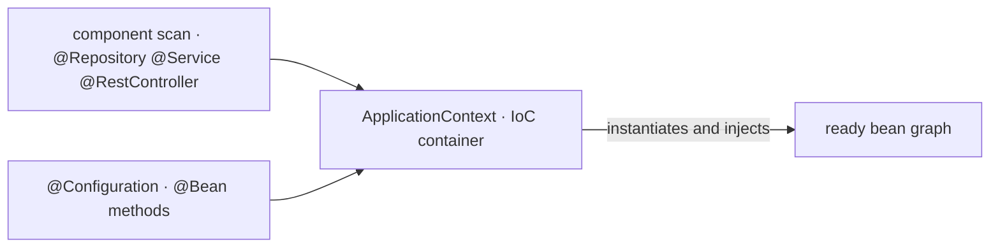

# 01 · Inversion of Control and Dependency Injection

<!-- badges -->


[](01-ioc-e-injecao-de-dependencia.md)
[](01-ioc-e-injecao-de-dependencia.en.md)

> 🌐 [Português](01-ioc-e-injecao-de-dependencia.md) · **English**

---

## The problem: who creates the dependencies?

Without a framework, each class assembles its own dependencies with `new`:

```java
public class VagaController {
    private final VagaService service = new VagaService(new VagaRepository());
    //                                  ^^^ coupled to concrete construction
}
```

That ties the controller to the exact way the service and repository are built.
Swapping the repository, adding a parameter, sharing an instance — each becomes a
cascading change.

## Inversion of Control (IoC)

**Inverting control** = taking the job of creating and wiring objects away from
business code and handing it to the **Spring container** (the
`ApplicationContext`).

The class now **declares** what it needs (in the constructor); the container
**provides** it.



## What a bean is

A **bean** is any object **managed by the container**. Lifecycle:


- **Singleton by default:** one instance per container, reused across all
  injections. (Other scopes exist, out of scope for Challenge 02.)
- `record`s are **not** beans — they are data. See [`02`](02-estereotipos-spring.en.md).

## The three injection types

| Type | How | When to use |
| ---- | --- | ----------- |
| **Constructor** | constructor params → `final` fields | **always** (project default) |
| Setter | `setX(...)` on the bean | genuinely optional dependency |
| Field | `@Autowired` on the attribute | avoid — hides the dependency, hurts testing |

### Constructor (what we use)

```java
@Service
public class VagaService {

    private final VagaRepository repository;   // final → required and immutable

    public VagaService(VagaRepository repository) {   // 1 constructor → no @Autowired
        this.repository = repository;
    }
}
```

### Setter

```java
@Service
public class RelatorioService {
    private FormatadorOpcional formatador;

    @Autowired(required = false)
    public void setFormatador(FormatadorOpcional f) { this.formatador = f; }
}
```

### Field (discouraged)

```java
@Service
public class VagaService {
    @Autowired private VagaRepository repository;   // don't: hidden dependency
}
```

## Why constructor injection

- **Explicit, required dependencies** — the constructor signature lists
  everything the class needs.
- **`final` fields** → immutable object after construction.
- **Tests without Spring** — `new VagaService(mockRepository)` and done.
- **Surfaces over-responsibility** — a 6-parameter constructor screams "this
  class does too much".
- Since **Spring 4.3**, with a **single constructor** `@Autowired` is optional.

## Common mistakes

| Mistake | Fix |
| ------- | --- |
| `new OtherProjectClass(...)` inside a bean | inject via constructor |
| `@Autowired` on a field | move to the constructor |
| Dependency field without `final` | make it `final` |
| Annotating a `record` with `@Component` | a `record` is never a bean |
| Circular dependency (A needs B, B needs A) | rethink the layer design |

## In arcanum-leque

- **Constructor injection only**, `final` fields.
- **No `new`** between project classes — wiring is always the container's job.
- `record`s are pure data: **not** beans, **no** Spring annotations.
- `EstatisticasService` injects `VagaRepository` directly (see
  [`03`](03-arquitetura-em-tres-camadas.en.md)).

## ✅ Checklist

- [ ] The class has **one** constructor and every dependency field is `final`.
- [ ] No `new` of a project class in the body.
- [ ] No `@Autowired` on a field.
- [ ] `record`s without bean annotations.

## 🗺️ See also

- [`02-estereotipos-spring.en.md`](02-estereotipos-spring.en.md) — which annotation marks the bean
- [`03-arquitetura-em-tres-camadas.en.md`](03-arquitetura-em-tres-camadas.en.md) — how dependencies flow
- [`04-desafio-02-leque-de-vagas.en.md`](04-desafio-02-leque-de-vagas.en.md) — the challenge rules
- [`README.en.md`](README.en.md)
