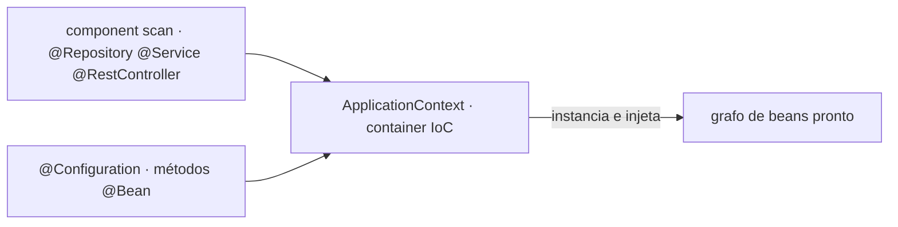
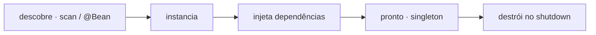

# 01 · Inversão de Controle e Injeção de Dependência

<!-- badges -->


[](01-ioc-e-injecao-de-dependencia.md)
[](01-ioc-e-injecao-de-dependencia.en.md)

> 🌐 **Português** · [English](01-ioc-e-injecao-de-dependencia.en.md)

---

## O problema: quem cria as dependências?

Sem framework, cada classe monta as próprias dependências com `new`:

```java
public class VagaController {
    private final VagaService service = new VagaService(new VagaRepository());
    //                                  ^^^ acoplado à construção concreta
}
```

Isso amarra o controller à forma exata de construir o service e o repository.
Trocar o repository, adicionar um parâmetro, compartilhar uma instância — tudo
vira mudança em cascata.

## Inversão de Controle (IoC)

**Inverter o controle** = tirar do código de negócio a responsabilidade de criar
e ligar objetos, e entregá-la ao **container do Spring** (o `ApplicationContext`).

A classe passa a **declarar** o que precisa (no construtor); o container
**providencia**.



## O que é um bean

Um **bean** é qualquer objeto **gerenciado pelo container**. Ciclo de vida:



- **Singleton por padrão:** uma instância por container, reaproveitada em todas as
  injeções. (Há outros *scopes*, fora do escopo do Desafio 02.)
- `record`s **não** são beans — são dados. Ver [`02`](02-estereotipos-spring.md).

## Os três tipos de injeção

| Tipo | Como | Quando usar |
| ---- | ---- | ----------- |
| **Construtor** | parâmetros do construtor → campos `final` | **sempre** (padrão do projeto) |
| Setter | `setX(...)` no bean | dependência genuinamente opcional |
| Campo | `@Autowired` no atributo | evitar — esconde dependência, dificulta teste |

### Construtor (o que usamos)

```java
@Service
public class VagaService {

    private final VagaRepository repository;   // final → obrigatório e imutável

    public VagaService(VagaRepository repository) {   // 1 construtor → sem @Autowired
        this.repository = repository;
    }
}
```

### Setter

```java
@Service
public class RelatorioService {
    private FormatadorOpcional formatador;

    @Autowired(required = false)
    public void setFormatador(FormatadorOpcional f) { this.formatador = f; }
}
```

### Campo (desencorajado)

```java
@Service
public class VagaService {
    @Autowired private VagaRepository repository;   // não use: dependência oculta
}
```

## Por que injeção por construtor

- **Dependências explícitas e obrigatórias** — a assinatura do construtor lista
  tudo de que a classe precisa.
- **Campos `final`** → objeto imutável depois de construído.
- **Testes sem Spring** — `new VagaService(mockRepository)` e pronto.
- **Detecta excesso de responsabilidade** — construtor com 6 parâmetros grita
  "essa classe faz coisa demais".
- Desde o **Spring 4.3**, com **um único construtor** o `@Autowired` é dispensável.

## Erros comuns

| Erro | Correção |
| ---- | -------- |
| `new OutraClasseDoProjeto(...)` dentro de um bean | injetar por construtor |
| `@Autowired` em campo | mover para o construtor |
| Campo de dependência sem `final` | tornar `final` |
| Anotar um `record` com `@Component` | `record` nunca é bean |
| Dependência circular (A precisa de B, B precisa de A) | revisar o desenho das camadas |

## No arcanum-leque

- Injeção **somente por construtor**, em campos `final`.
- **Nenhum `new`** entre classes do projeto — a ligação é sempre do container.
- `record`s são dados puros: **não** são beans e **não** levam anotações do Spring.
- `EstatisticasService` injeta `VagaRepository` diretamente (ver
  [`03`](03-arquitetura-em-tres-camadas.md)).

## ✅ Checklist

- [ ] A classe tem **um** construtor e todos os campos de dependência são `final`.
- [ ] Nenhum `new` de classe do projeto no corpo.
- [ ] Nenhum `@Autowired` em campo.
- [ ] `record`s sem anotação de bean.

## 🗺️ Ver também

- [`02-estereotipos-spring.md`](02-estereotipos-spring.md) — qual anotação marca o bean
- [`03-arquitetura-em-tres-camadas.md`](03-arquitetura-em-tres-camadas.md) — como as dependências fluem
- [`04-desafio-02-leque-de-vagas.md`](04-desafio-02-leque-de-vagas.md) — as regras do desafio
- [`README.md`](README.md)
