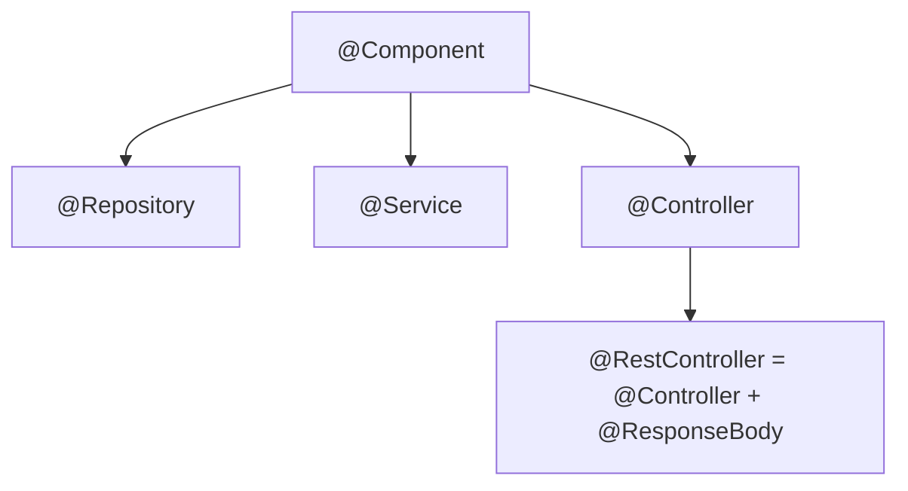
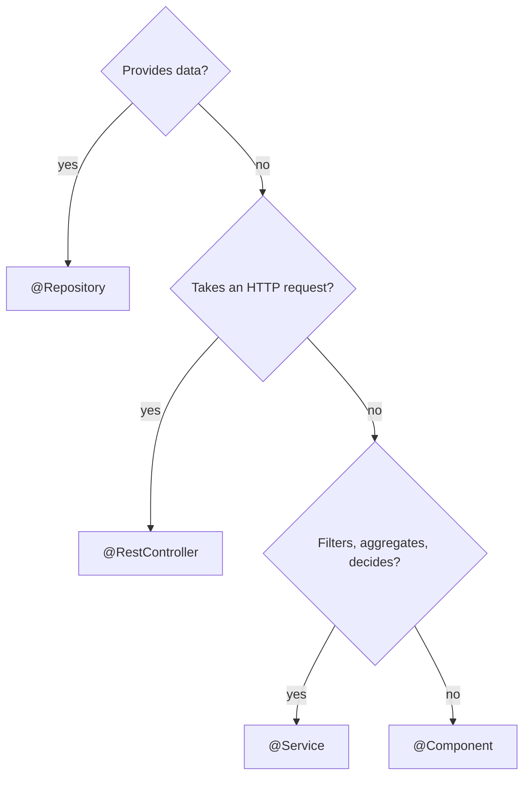

# 02 · Spring stereotypes

<!-- badges -->


[](02-estereotipos-spring.md)
[](02-estereotipos-spring.en.md)

> 🌐 [Português](02-estereotipos-spring.md) · **English**

---

## What they are

Annotations that **(1)** mark a class as a bean (so the *component scan* finds it)
and **(2)** communicate its **role** in the architecture. All are specializations
of `@Component`.



| Annotation | Role | Layer |
| ---------- | ---- | ----- |
| `@Component` | generic bean | any |
| `@Repository` | data access / data source | persistence |
| `@Service` | business logic, orchestration | service |
| `@RestController` | HTTP endpoints returning JSON | presentation (web) |

## Which annotation?



## `@Repository` — provides data

In Challenge 02, it returns **in-memory lists** (no database).

```java
@Repository
public class VagaRepository {
    public List<Vaga> todas() {
        return List.of(
            new Vaga("1", "Dev Back-end Júnior", "...", "Back-end", "Júnior",
                     "Remoto", true, "aurora-tech")
            // ... ≥ 12 jobs
        );
    }
}
```

**Does not do:** business logic (filter by area, count, decide).

## `@Service` — decides

Filters, aggregates, computes. **Knows no HTTP** (no status, request, response).

```java
@Service
public class VagaService {
    private final VagaRepository repository;
    public VagaService(VagaRepository repository) { this.repository = repository; }

    public List<Vaga> listar() { return repository.todas(); }

    public Vaga buscarPorId(String id) {
        return repository.todas().stream()
            .filter(v -> v.id().equals(id))
            .findFirst().orElse(null);
    }
}
```

## `@RestController` — exposes over HTTP

Takes the request, calls **one** service method, returns the result.
**No `if`/`for` business logic.**

```java
@RestController
@RequestMapping("/vagas")
public class VagaController {
    private final VagaService service;
    public VagaController(VagaService service) { this.service = service; }

    @GetMapping
    public List<Vaga> listar() { return service.listar(); }

    @GetMapping("/{id}")
    public Vaga buscar(@PathVariable String id) { return service.buscarPorId(id); }
}
```

## `@Bean` (inside `@Configuration`)

To register as a bean an object whose class you **cannot annotate** (e.g. from a
library): declare a `@Bean` method in a `@Configuration` class. Probably not
needed in Challenge 02.

```java
@Configuration
public class AppConfig {
    @Bean
    public Clock clock() { return Clock.systemUTC(); }
}
```

## `@Component` vs. a specific stereotype

They behave the same for the container. The difference is **semantic** (it
signals intent), and for `@Repository` there is persistence-exception
translation — irrelevant while there is no database, but it is the **correct**
stereotype for the data layer.

## Common mistakes

| Mistake | Fix |
| ------- | --- |
| `@RestController` with a loop that filters/counts | move the logic to `@Service` |
| `@Service` injecting `HttpServletRequest` | a service knows no HTTP |
| `record Vaga` annotated with `@Component` | a `record` is never a bean |
| `@Repository` deciding "which jobs to show" | that is a rule → `@Service` |
| Two stereotype annotations on one class | pick one |

## In arcanum-leque

- Each front has exactly the three layers with the correct stereotype.
- `record`s (`Vaga`, `Empresa`, `Pessoa`) **never** get a stereotype.

## ✅ Checklist

- [ ] Repository only fetches data; Service only decides; Controller only exposes.
- [ ] No annotated `record`.
- [ ] One stereotype per class.

## 🗺️ See also

- [`01-ioc-e-injecao-de-dependencia.en.md`](01-ioc-e-injecao-de-dependencia.en.md) — how the bean is injected
- [`03-arquitetura-em-tres-camadas.en.md`](03-arquitetura-em-tres-camadas.en.md) — what each layer can/cannot do
- [`README.en.md`](README.en.md)
