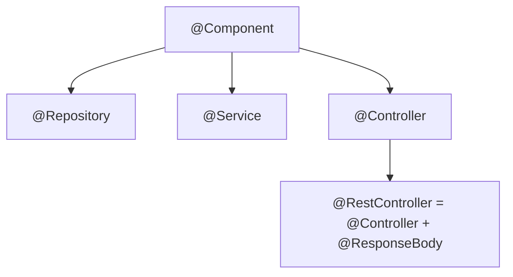
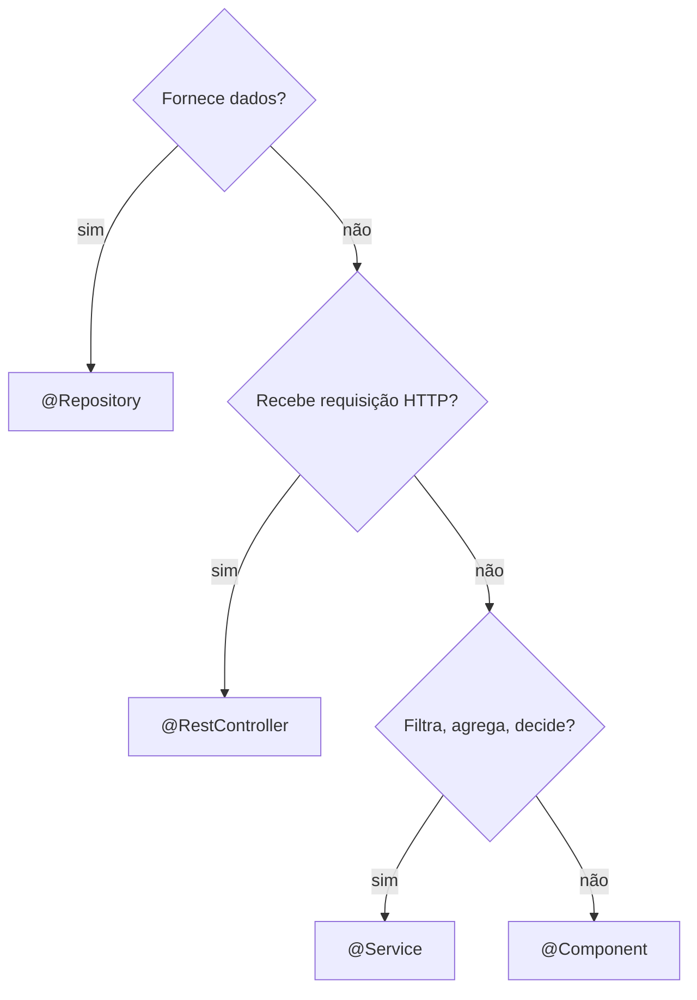

# 02 · Estereótipos (stereotypes) do Spring

<!-- badges -->


[](02-estereotipos-spring.md)
[](02-estereotipos-spring.en.md)

> 🌐 **Português** · [English](02-estereotipos-spring.en.md)

---

## O que são

Anotações que **(1)** marcam a classe como bean (para o *component scan* achar) e
**(2)** comunicam o **papel** dela na arquitetura. Todas são especializações de
`@Component`.



| Anotação | Papel | Camada |
| -------- | ----- | ------ |
| `@Component` | bean genérico | qualquer |
| `@Repository` | acesso a dados / fonte de dados | persistência |
| `@Service` | regra de negócio, orquestração | serviço |
| `@RestController` | endpoints HTTP que retornam JSON | apresentação (web) |

## Qual anotação usar?



## `@Repository` — fornece dados

No Desafio 02, devolve **listas em memória** (sem banco).

```java
@Repository
public class VagaRepository {
    public List<Vaga> todas() {
        return List.of(
            new Vaga("1", "Dev Back-end Júnior", "...", "Back-end", "Júnior",
                     "Remoto", true, "aurora-tech")
            // ... ≥ 12 vagas
        );
    }
}
```

**Não faz:** regra de negócio (filtrar por área, contar, decidir).

## `@Service` — decide

Filtra, agrega, calcula. **Não conhece HTTP** (nada de status, request, response).

```java
@Service
public class VagaService {
    private final VagaRepository repository;
    public VagaService(VagaRepository repository) { this.repository = repository; }

    public List<Vaga> listar() { return repository.todas(); }

    public Vaga buscarPorId(String id) {
        return repository.todas().stream()
            .filter(v -> v.id().equals(id))
            .findFirst().orElse(null);
    }
}
```

## `@RestController` — expõe por HTTP

Recebe a requisição, chama **um** método do service, devolve o resultado.
**Sem `if`/`for` de regra de negócio.**

```java
@RestController
@RequestMapping("/vagas")
public class VagaController {
    private final VagaService service;
    public VagaController(VagaService service) { this.service = service; }

    @GetMapping
    public List<Vaga> listar() { return service.listar(); }

    @GetMapping("/{id}")
    public Vaga buscar(@PathVariable String id) { return service.buscarPorId(id); }
}
```

## `@Bean` (em `@Configuration`)

Para registrar como bean um objeto de classe que você **não pode anotar** (ex.:
de uma biblioteca): declara-se um método `@Bean` numa classe `@Configuration`.
No Desafio 02 provavelmente não é necessário.

```java
@Configuration
public class AppConfig {
    @Bean
    public Clock clock() { return Clock.systemUTC(); }
}
```

## `@Component` vs estereótipo específico

Funcionam igual para o container. A diferença é **semântica** (comunica intenção)
e, no caso de `@Repository`, há tradução de exceções de persistência — irrelevante
enquanto não há banco, mas é o estereótipo **correto** para a camada de dados.

## Erros comuns

| Erro | Correção |
| ---- | -------- |
| `@RestController` com laço que filtra/conta | mover a lógica para o `@Service` |
| `@Service` injetando `HttpServletRequest` | serviço não conhece HTTP |
| `record Vaga` anotado com `@Component` | `record` nunca é bean |
| `@Repository` decidindo "quais vagas mostrar" | isso é regra → `@Service` |
| Duas anotações de estereótipo na mesma classe | escolher uma |

## No arcanum-leque

- Cada frente tem exatamente as três camadas com o estereótipo correto.
- `record`s (`Vaga`, `Empresa`, `Pessoa`) **nunca** recebem estereótipo.

## ✅ Checklist

- [ ] Repository só busca dado; Service só decide; Controller só expõe.
- [ ] Nenhum `record` anotado.
- [ ] Um estereótipo por classe.

## 🗺️ Ver também

- [`01-ioc-e-injecao-de-dependencia.md`](01-ioc-e-injecao-de-dependencia.md) — como o bean é injetado
- [`03-arquitetura-em-tres-camadas.md`](03-arquitetura-em-tres-camadas.md) — o que cada camada pode/não pode
- [`README.md`](README.md)
