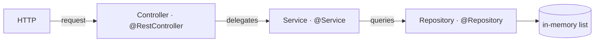
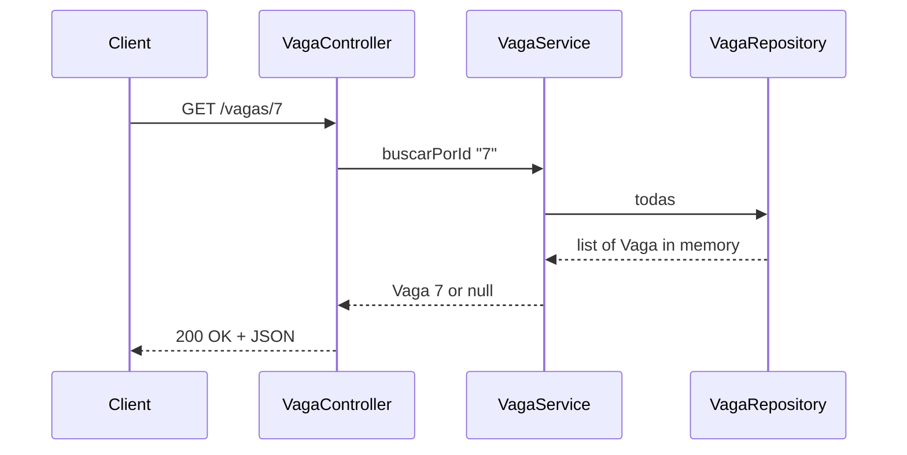
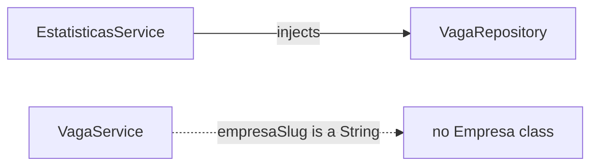

# 03 · Three-layer architecture

<!-- badges -->

> 🌐 [Português](03-arquitetura-em-tres-camadas.md) · **English**

The pattern repeated by **every** front in arcanum-leque.

---

## The flow

The response takes the reverse path: `Repository → Service → Controller`, and the
controller returns it as JSON + status.

| Layer | Responsibility | **Cannot** |
| ----- | -------------- | ---------- |
| **Controller** | take the request, extract params, call **one** service method, return the response | business logic (`if`/`for` decisions); touch the repository directly |
| **Service** | filter, aggregate, compute, decide, orchestrate | know HTTP (request, response, status) |
| **Repository** | provide the data | business logic |

## One request, step by step

The controller never talks to the repository; the service never builds the JSON
nor picks the status.

## Summary by question

| Layer | Answers | Knows HTTP? | Knows the data source? |
| ----- | ------- | :---------: | :--------------------: |
| Controller | "which route is this and what do I return?" | ✅ | ❌ |
| Service | "what is the rule?" | ❌ | ❌ |
| Repository | "where is the data?" | ❌ | ✅ |

## Dependency flow

Always downward, always by constructor:

- `Controller` depends on `Service`
- `Service` depends on `Repository`
- **Challenge 02 exception:** `EstatisticasService` depends **directly** on
  `VagaRepository` — *"business logic fetches data and decides; it does not call
  another rule out of laziness"*.

### Between fronts (code)

- **Estatísticas → Vaga**: the only code dependency. `EstatisticasService`
  injects `VagaRepository`. Per the statement it aggregates jobs only; reading
  `Empresa`/`Pessoa` too is a possible extension, but it would couple front 4 to
  all three.
- **Vaga ↔ Empresa**: **not a code dependency**. `empresaSlug` is a `String` —
  a **by-value** reference, not an `Empresa` object nor an injected
  `EmpresaRepository`. That is what lets fronts 1 and 2 progress in parallel.
  Validating "does the slug exist?" is a later lesson (then `VagaService` would
  consult `EmpresaRepository`).
- **Pessoa**: none. The person↔job application is not modeled yet.

### Persistence

Every repository returns **fixed in-memory lists** — a team decision (see
[`../planning/`](../planning/README.en.md)). For the project's volume a real DB
is over-engineering. Only the repository knows where data comes from; swapping in
a database later touches neither service nor controller.

## Contract before code

Front 1 commits the `record Vaga` and the `VagaRepository.todas()` signature
first, so the other fronts compile against a known type and work proceeds in
parallel.

## Why split it this way

- **Testability:** the service is testable with a fake repository, no HTTP.
- **Swap the data source:** list → database touches only the repository.
- **Swap the transport:** HTTP → messaging touches only the controller.
- **Division of labor:** each front is an isolated trio → 4 people in parallel.

## Common mistakes

| Mistake | Fix |
| ------- | --- |
| Controller with rule-bearing `stream().filter(...)` | move it to the service |
| Service returning `ResponseEntity` / setting status | that belongs to the controller |
| Controller injecting `VagaRepository` | inject `VagaService` |
| `EstatisticasController` holding the counting logic | counting belongs to `EstatisticasService` |

## ✅ Integration checklist

- [ ] All 7 routes respond.
- [ ] Every `empresaSlug` in `/vagas` exists in `/empresas`.
- [ ] The `/estatisticas` numbers match `/vagas`.
- [ ] No controller touches a repository; no service knows HTTP.

## 🗺️ See also

- [`01-ioc-e-injecao-de-dependencia.en.md`](01-ioc-e-injecao-de-dependencia.en.md)
- [`02-estereotipos-spring.en.md`](02-estereotipos-spring.en.md)
- [`04-desafio-02-leque-de-vagas.en.md`](04-desafio-02-leque-de-vagas.en.md)
- [`../planning/contexto-e-publico-alvo.en.md`](../planning/contexto-e-publico-alvo.en.md)
- [`README.en.md`](README.en.md)
