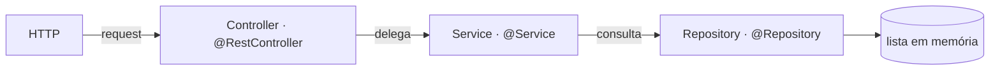
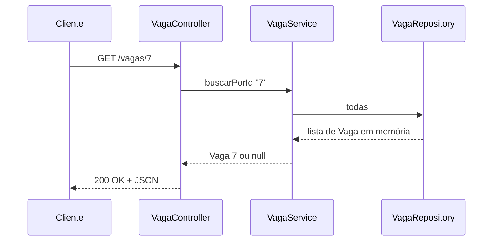
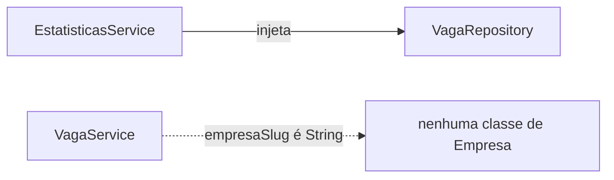

# 03 · Arquitetura em três camadas

<!-- badges -->

> 🌐 **Português** · [English](03-arquitetura-em-tres-camadas.en.md)

Padrão repetido por **todas** as frentes do arcanum-leque.

---

## O fluxo

A resposta percorre o caminho inverso: `Repository → Service → Controller`, e o
controller a devolve como JSON + status.

| Camada | Responsabilidade | **Não pode** |
| ------ | ---------------- | ------------ |
| **Controller** | receber a requisição, extrair parâmetros, chamar **um** método do service, devolver a resposta | regra de negócio (`if`/`for` de decisão); acessar o repository direto |
| **Service** | filtrar, agregar, calcular, decidir, orquestrar | conhecer HTTP (request, response, status) |
| **Repository** | fornecer os dados | regra de negócio |

## Uma requisição, passo a passo

O controller nunca fala com o repository; o service nunca monta o JSON nem
escolhe o status.

## Resumo por pergunta

| Camada | Responde | Sabe de HTTP? | Sabe da origem dos dados? |
| ------ | -------- | :-----------: | :-----------------------: |
| Controller | "que rota é e o que devolvo?" | ✅ | ❌ |
| Service | "qual é a regra?" | ❌ | ❌ |
| Repository | "cadê os dados?" | ❌ | ✅ |

## Fluxo de dependências

Sempre para baixo, sempre por construtor:

- `Controller` depende de `Service`
- `Service` depende de `Repository`
- **Exceção do Desafio 02:** `EstatisticasService` depende **direto** do
  `VagaRepository` — *"regra de negócio busca dado e decide, não chama outra
  regra por preguiça"*.

### Entre frentes (código)

- **Estatísticas → Vaga**: a única dependência de código. `EstatisticasService`
  injeta `VagaRepository`. Pelo enunciado só agrega vagas; ler `Empresa`/`Pessoa`
  também é extensão possível, mas acoplaria a frente 4 às três.
- **Vaga ↔ Empresa**: **não é dependência de código**. `empresaSlug` é uma
  `String` — referência **por valor**, não um objeto `Empresa` nem um
  `EmpresaRepository` injetado. É o que permite as frentes 1 e 2 andarem em
  paralelo. Validar "o slug existe?" é de aula futura (aí sim `VagaService`
  consultaria `EmpresaRepository`).
- **Pessoa**: nenhuma. A candidatura pessoa↔vaga ainda não é modelada.

### Persistência

Todos os repositories devolvem **listas fixas em memória** — decisão do time
(ver [`../planning/`](../planning/)). Para o volume do projeto, banco real é
over-engineering. Só o repository sabe de onde os dados vêm; trocar por banco no
futuro não afeta service nem controller.

## Contrato antes do código

A Parte 1 comita primeiro o `record Vaga` e a assinatura de
`VagaRepository.todas()`, para as outras frentes compilarem contra um tipo
conhecido e o trabalho seguir em paralelo.

## Por que separar assim

- **Testabilidade:** service testável com um repository falso, sem subir HTTP.
- **Troca de fonte de dados:** lista → banco mexe só no repository.
- **Troca de transporte:** HTTP → mensageria mexe só no controller.
- **Divisão de trabalho:** cada frente é um trio isolado → 4 pessoas em paralelo.

## Erros comuns

| Erro | Correção |
| ---- | -------- |
| Controller com `stream().filter(...)` de regra | mover para o service |
| Service devolvendo `ResponseEntity` / setando status | isso é do controller |
| Controller injetando `VagaRepository` | injetar `VagaService` |
| `EstatisticasController` com a lógica de contagem | contagem é do `EstatisticasService` |

## ✅ Checklist de integração

- [ ] As 7 rotas respondem.
- [ ] Todo `empresaSlug` de `/vagas` existe em `/empresas`.
- [ ] Os números de `/estatisticas` batem com `/vagas`.
- [ ] Nenhum controller acessa repository; nenhum service conhece HTTP.

## 🗺️ Ver também

- [`01-ioc-e-injecao-de-dependencia.md`](01-ioc-e-injecao-de-dependencia.md)
- [`02-estereotipos-spring.md`](02-estereotipos-spring.md)
- [`04-desafio-02-leque-de-vagas.md`](04-desafio-02-leque-de-vagas.md)
- [`../planning/contexto-e-publico-alvo.md`](../planning/contexto-e-publico-alvo.md)
- [`README.md`](README.md)
