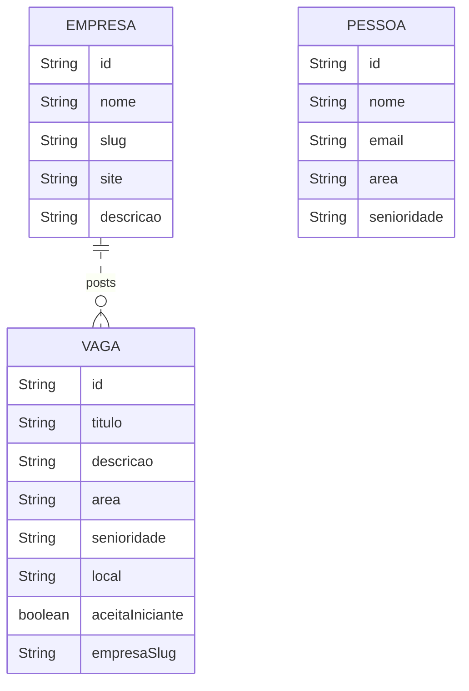
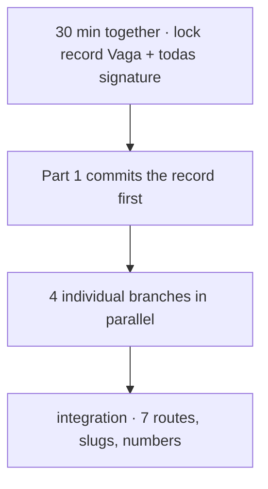

# 04 · Challenge 02 — The skeleton of Leque de Vagas

<!-- badges -->


[](04-desafio-02-leque-de-vagas.md)
[](04-desafio-02-leque-de-vagas.en.md)

> 🌐 [Português](04-desafio-02-leque-de-vagas.md) · **English**

> Lesson 02 · *Beans and Dependency Injection*
> <https://aulas.umlequedetecnologia.com.br/cursos/introducao-spring-boot/aula-02-beans-e-injecao/desafio>

> Field, method and JSON-key names are kept in Portuguese because the statement
> requires them verbatim.

---

## 🎯 Goal

Build a Spring Boot API with **four parallel fronts**, each following the same
pattern (`controller → service → repository`) with **in-memory data** — no
database, no DTO, no validation, no error handling.

## 🗂️ The data (overview)



> `PESSOA` does not link to `VAGA` in this phase — the application comes later.

---

## Part 1 — Vaga (main front)

`record Vaga`:

| Field | Type | Note |
| ----- | ---- | ---- |
| `id` | `String` | |
| `titulo` | `String` | title |
| `descricao` | `String` | description |
| `area` | `String` | Front-end, Back-end, Dados, Mobile |
| `senioridade` | `String` | Estágio, Júnior, Pleno, Sênior |
| `local` | `String` | location |
| `aceitaIniciante` | `boolean` | mix `true`/`false` |
| `empresaSlug` | `String` | must exist in Part 2 |

- `VagaRepository.todas()` — **at least 12 jobs**, 4+ areas, 3+ seniorities.
- `VagaService` — `listar()`, `buscarPorId(String id)`.
- `VagaController`:
  - `GET /vagas` → full list
  - `GET /vagas/{id}` → one job (or empty)

**Done when:** both routes respond, there are ≥ 12 varied jobs, the `record` is
already committed for the other fronts.

## Part 2 — Empresa

`record Empresa`: `id`, `nome`, `slug`, `site`, `descricao`.

- **At least 5 companies**; `slug` matching the jobs' `empresaSlug`
  (e.g. `aurora-tech`).
- `GET /empresas` → list
- `GET /empresas/{slug}` → lookup by slug

**Done when:** both routes respond and every slug used by Part 1 exists here.

## Part 3 — Pessoa (candidates)

`record Pessoa`: `id`, `nome`, `email`, `area`, `senioridade`.
(No password — that arrives in lesson 10, with security.)

- **At least 6 people**.
- `GET /pessoas` → list
- `GET /pessoas/{id}` → one person

**Done when:** both routes respond with ≥ 6 people.

## Part 4 — Estatísticas (no resource of its own)

- `EstatisticasService` takes **`VagaRepository`** via constructor (not the service).
- `EstatisticasController` with **one** route.

`GET /estatisticas`:

```json
{
  "totalDeVagas": 12,
  "aceitamIniciante": 7,
  "porArea": { "Front-end": 4, "Back-end": 3, "Dados": 3, "Mobile": 2 },
  "porSenioridade": { "Estágio": 2, "Júnior": 6, "Pleno": 4 }
}
```

| Field | How to compute |
| ----- | -------------- |
| `totalDeVagas` | `todas().size()` |
| `aceitamIniciante` | count `aceitaIniciante == true` |
| `porArea` | group by `area`, count |
| `porSenioridade` | group by `senioridade`, count |

**Done when:** the route responds and the numbers match `/vagas`.

---

## 🧭 The 7 routes

| # | Method | Route | Front |
| - | ------ | ----- | ----- |
| 1 | GET | `/vagas` | Vaga |
| 2 | GET | `/vagas/{id}` | Vaga |
| 3 | GET | `/empresas` | Empresa |
| 4 | GET | `/empresas/{slug}` | Empresa |
| 5 | GET | `/pessoas` | Pessoa |
| 6 | GET | `/pessoas/{id}` | Pessoa |
| 7 | GET | `/estatisticas` | Estatísticas |

## ✅ Mandatory principles

- Dependency injection **by constructor only**, `final` field.
- **No `new`** between project classes.
- No business logic in controllers (no rule-bearing `if`/`for`).
- `record`s **without** Spring annotations.
- One person per front (individual commits, traceable Git history).

## ⛔ What NOT to do

- Database (arrives in lesson 05 — but the team chose to stay in memory)
- DTOs, validation, error handling (lessons 03–04)
- One person on two parts
- A single monolithic class
- A `record` annotated as a bean

## 🔄 Workflow



1. **30 min before coding:** the team locks the `record Vaga` and the
   `VagaRepository.todas()` signature.
2. Part 1 commits the record first → the others compile against a known type.
3. Individual branches in the same repository.
4. Integration: 7 routes responding, valid `empresaSlug`s, consistent numbers.

> ℹ️ **Team decision (D7):** instead of branches in the same repository, the flow
> is **fork + Pull Request** with `main` · `develop` · `feat/<front>`. Step by
> step and diagrams in [`../../.github/CONTRIBUTING.en.md`](../../.github/CONTRIBUTING.en.md).

## 🏅 Grading

| Criterion | Weight |
| --------- | ------ |
| Three layers with correct stereotypes | 30% |
| Constructor injection | 25% |
| Seven routes responding with consistent data | 25% |
| Teamwork (individual commits, README) | 20% |

## 📦 Delivery

- GitHub repository link
- README identifying the four fronts and their owners
- At least one commit per person

## 🗺️ See also

- [`03-arquitetura-em-tres-camadas.en.md`](03-arquitetura-em-tres-camadas.en.md)
- [`../planning/contexto-e-publico-alvo.en.md`](../planning/contexto-e-publico-alvo.en.md)
- [`README.en.md`](README.en.md)
