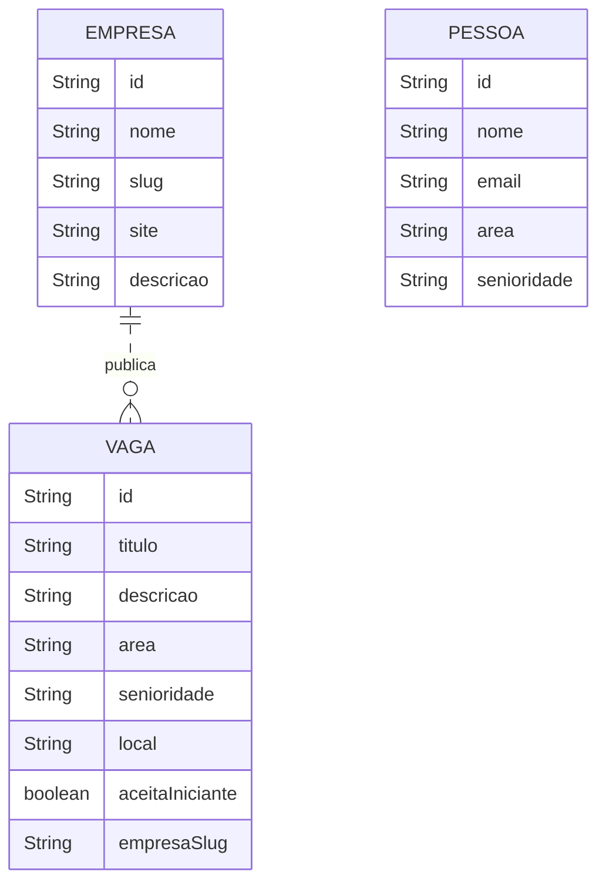
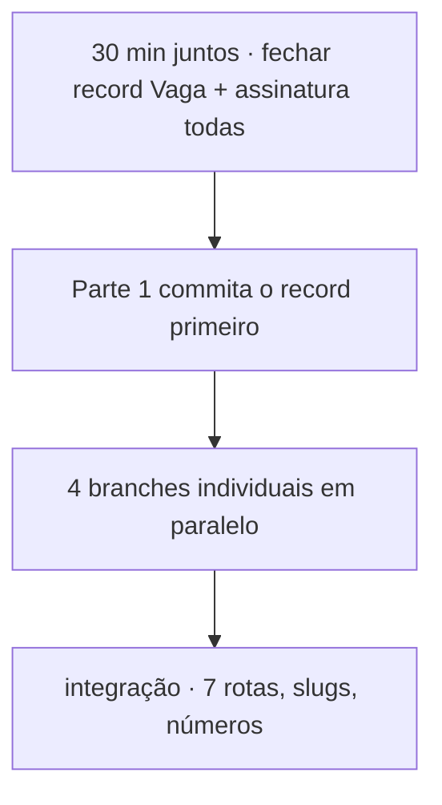

# 04 · Desafio 02 — O esqueleto do Leque de Vagas

<!-- badges -->


[](04-desafio-02-leque-de-vagas.md)
[](04-desafio-02-leque-de-vagas.en.md)

> 🌐 **Português** · [English](04-desafio-02-leque-de-vagas.en.md)

> Aula 02 · *Beans e Injeção de Dependência*
> <https://aulas.umlequedetecnologia.com.br/cursos/introducao-spring-boot/aula-02-beans-e-injecao/desafio>

---

## 🎯 Objetivo

Construir uma API Spring Boot com **quatro frentes paralelas**, cada uma com o
mesmo padrão (`controller → service → repository`) e **dados em memória** — sem
banco, sem DTO, sem validação, sem tratamento de erro.

## 🗂️ Os dados (visão geral)



> `PESSOA` não se liga a `VAGA` nesta fase — a candidatura vem depois.

---

## Parte 1 — Vaga (frente principal)

`record Vaga`:

| Campo | Tipo | Observação |
| ----- | ---- | ---------- |
| `id` | `String` | |
| `titulo` | `String` | |
| `descricao` | `String` | |
| `area` | `String` | Front-end, Back-end, Dados, Mobile |
| `senioridade` | `String` | Estágio, Júnior, Pleno, Sênior |
| `local` | `String` | |
| `aceitaIniciante` | `boolean` | misturar `true`/`false` |
| `empresaSlug` | `String` | tem de existir na Parte 2 |

- `VagaRepository.todas()` — **mínimo 12 vagas**, 4+ áreas, 3+ senioridades.
- `VagaService` — `listar()`, `buscarPorId(String id)`.
- `VagaController`:
  - `GET /vagas` → lista inteira
  - `GET /vagas/{id}` → vaga específica (ou vazio)

**Feito quando:** as 2 rotas respondem, há ≥ 12 vagas variadas, o `record` já foi
commitado para as outras frentes.

## Parte 2 — Empresa

`record Empresa`: `id`, `nome`, `slug`, `site`, `descricao`.

- **Mínimo 5 empresas**; `slug` casando com `empresaSlug` das vagas
  (ex.: `aurora-tech`).
- `GET /empresas` → lista
- `GET /empresas/{slug}` → busca por slug

**Feito quando:** as 2 rotas respondem e todos os slugs usados pela Parte 1
existem aqui.

## Parte 3 — Pessoa (candidatos)

`record Pessoa`: `id`, `nome`, `email`, `area`, `senioridade`.
(Sem senha — isso entra na aula 10, com segurança.)

- **Mínimo 6 pessoas**.
- `GET /pessoas` → lista
- `GET /pessoas/{id}` → pessoa específica

**Feito quando:** as 2 rotas respondem com ≥ 6 pessoas.

## Parte 4 — Estatísticas (sem recurso próprio)

- `EstatisticasService` recebe **`VagaRepository`** por construtor (não o service).
- `EstatisticasController` com **uma** rota.

`GET /estatisticas`:

```json
{
  "totalDeVagas": 12,
  "aceitamIniciante": 7,
  "porArea": { "Front-end": 4, "Back-end": 3, "Dados": 3, "Mobile": 2 },
  "porSenioridade": { "Estágio": 2, "Júnior": 6, "Pleno": 4 }
}
```

| Campo | Como calcular |
| ----- | ------------- |
| `totalDeVagas` | `todas().size()` |
| `aceitamIniciante` | contar `aceitaIniciante == true` |
| `porArea` | agrupar por `area`, contar |
| `porSenioridade` | agrupar por `senioridade`, contar |

**Feito quando:** a rota responde e os números batem com `/vagas`.

---

## 🧭 As 7 rotas

| # | Método | Rota | Frente |
| - | ------ | ---- | ------ |
| 1 | GET | `/vagas` | Vaga |
| 2 | GET | `/vagas/{id}` | Vaga |
| 3 | GET | `/empresas` | Empresa |
| 4 | GET | `/empresas/{slug}` | Empresa |
| 5 | GET | `/pessoas` | Pessoa |
| 6 | GET | `/pessoas/{id}` | Pessoa |
| 7 | GET | `/estatisticas` | Estatísticas |

## ✅ Princípios obrigatórios

- Injeção de dependência **apenas por construtor**, em campo `final`.
- **Nenhum `new`** entre classes do projeto.
- Sem lógica de negócio em controllers (nada de `if`/`for` de regra).
- `record`s **sem** anotações do Spring.
- Cada pessoa faz uma frente (commits individuais, Git rastreável).

## ⛔ O que NÃO fazer

- Banco de dados (chega na aula 05 — mas o time decidiu manter memória)
- DTOs, validações, tratamento de erro (aulas 03–04)
- Uma pessoa em duas partes
- Classe monolítica única
- `record` anotado como bean

## 🔄 Processo de trabalho



1. **30 min antes de codar:** a equipe fecha o `record Vaga` e a assinatura de
   `VagaRepository.todas()`.
2. Parte 1 comita o record primeiro → as demais compilam contra tipo conhecido.
3. Branches individuais no mesmo repositório.
4. Integração: 7 rotas respondendo, `empresaSlug` válidos, números coerentes.

> ℹ️ **Decisão do time (D7):** em vez de branches no mesmo repositório, o fluxo é
> **fork + Pull Request** com `main` · `develop` · `feat/<frente>`. Passo a passo
> e diagramas em [`../../.github/CONTRIBUTING.md`](../../.github/CONTRIBUTING.md).

## 🏅 Avaliação

| Critério | Peso |
| -------- | ---- |
| Três camadas com estereótipos corretos | 30% |
| Injeção por construtor | 25% |
| Sete rotas respondendo com dados coerentes | 25% |
| Trabalho em equipe (commits individuais, README) | 20% |

## 📦 Entrega

- Link do repositório GitHub
- README identificando as quatro frentes e os responsáveis
- Mínimo um commit por pessoa

## 🗺️ Ver também

- [`03-arquitetura-em-tres-camadas.md`](03-arquitetura-em-tres-camadas.md)
- [`../planning/contexto-e-publico-alvo.md`](../planning/contexto-e-publico-alvo.md)
- [`README.md`](README.md)
