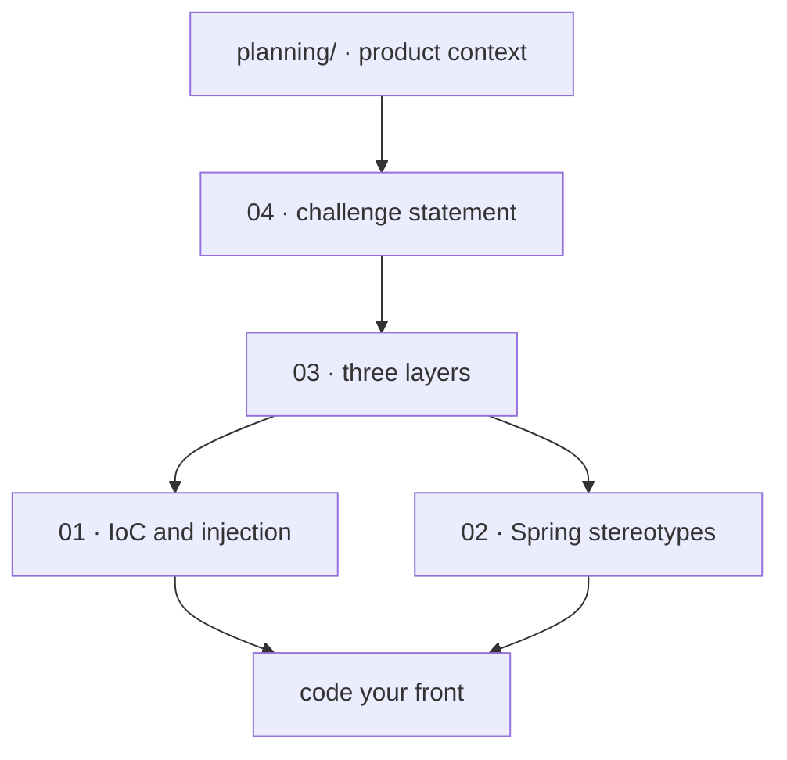

# 📖 academic/references

<!-- badges -->

> 🌐 [Português](README.md) · **English**

Theory that underpins **arcanum-leque**, organized from the *Introduction to
Spring Boot* course (Um Leque de Tecnologia), lesson *Beans and Dependency
Injection*.

---

## 📚 Index

| # | File | Topic | Read when… |
| - | ---- | ----- | ---------- |
| 01 | [`01-ioc-e-injecao-de-dependencia.en.md`](01-ioc-e-injecao-de-dependencia.en.md) | IoC, container, beans, injection types | you want to understand *why* constructor injection |
| 02 | [`02-estereotipos-spring.en.md`](02-estereotipos-spring.en.md) | `@Component`, `@Service`, `@Repository`, `@RestController`, `@Bean` | you are about to annotate a class |
| 03 | [`03-arquitetura-em-tres-camadas.en.md`](03-arquitetura-em-tres-camadas.en.md) | `controller → service → repository` | you are deciding what goes in each layer |
| 04 | [`04-desafio-02-leque-de-vagas.en.md`](04-desafio-02-leque-de-vagas.en.md) | Full statement of Challenge 02 | you need exact fields, data minimums, routes |

> 🧭 Product context, audience and **team decisions** live in
> [`../planning/`](../planning/README.en.md), not here.

---

## 🗺️ Where to start

---

## ✅ Rules these docs lock in

- **Constructor injection only**, `final` field; **no `new`** between classes.
- Stereotypes: `@Repository` / `@Service` / `@RestController`.
- No business logic in the controller; `record`s without annotations.
- `empresaSlug` (job) == `slug` (company), identical string.
- No password until lesson 10.
- Names required by the statement stay in **Portuguese**.

---

## 🔗 Source

Lesson 02 — *Beans and Dependency Injection*
<https://aulas.umlequedetecnologia.com.br/cursos/introducao-spring-boot/aula-02-beans-e-injecao/desafio>

## 🗺️ See also

- [`../README.en.md`](../README.en.md) · [`../../README.en.md`](../../README.en.md)
- [`../planning/README.en.md`](../planning/README.en.md) — context and decisions
- [`CLAUDE.md`](CLAUDE.md) (PT only)
