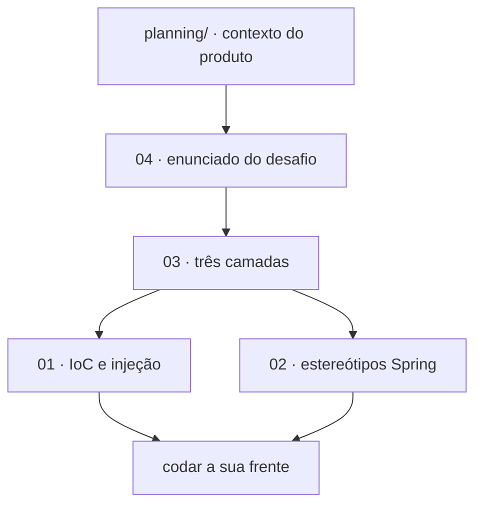

# 📖 academic/references

<!-- badges -->

> 🌐 **Português** · [English](README.en.md)

Base teórica que fundamenta o **arcanum-leque**, organizada a partir do curso
*Introdução ao Spring Boot* (Um Leque de Tecnologia), aula *Beans e Injeção de
Dependência*.

---

## 📚 Índice

| # | Arquivo | Assunto | Leia quando… |
| - | ------- | ------- | ------------ |
| 01 | [`01-ioc-e-injecao-de-dependencia.md`](01-ioc-e-injecao-de-dependencia.md) | IoC, container, beans, tipos de injeção | quiser entender *por que* injeção por construtor |
| 02 | [`02-estereotipos-spring.md`](02-estereotipos-spring.md) | `@Component`, `@Service`, `@Repository`, `@RestController`, `@Bean` | for anotar uma classe |
| 03 | [`03-arquitetura-em-tres-camadas.md`](03-arquitetura-em-tres-camadas.md) | `controller → service → repository` | estiver decidindo o que vai em cada camada |
| 04 | [`04-desafio-02-leque-de-vagas.md`](04-desafio-02-leque-de-vagas.md) | Enunciado completo do Desafio 02 | precisar dos campos exatos, mínimos de dados, rotas |

> 🧭 Contexto do produto, público-alvo e **decisões do time** ficam em
> [`../planning/`](../planning/), não aqui.

---

## 🗺️ Por onde começar

---

## ✅ Regras que estes docs travam

- Injeção **só por construtor**, campo `final`; **nenhum `new`** entre classes.
- Estereótipos: `@Repository` / `@Service` / `@RestController`.
- Sem regra de negócio no controller; `record`s sem anotação.
- `empresaSlug` (vaga) == `slug` (empresa), string idêntica.
- Sem senha até a aula 10.
- Nomes exigidos pelo enunciado em **português**.

---

## 🔗 Fonte

Aula 02 — *Beans e Injeção de Dependência*
<https://aulas.umlequedetecnologia.com.br/cursos/introducao-spring-boot/aula-02-beans-e-injecao/desafio>

## 🗺️ Ver também

- [`../README.md`](../README.md) · [`../../README.md`](../../README.md)
- [`../planning/README.md`](../planning/README.md) — contexto e decisões
- [`CLAUDE.md`](CLAUDE.md)
