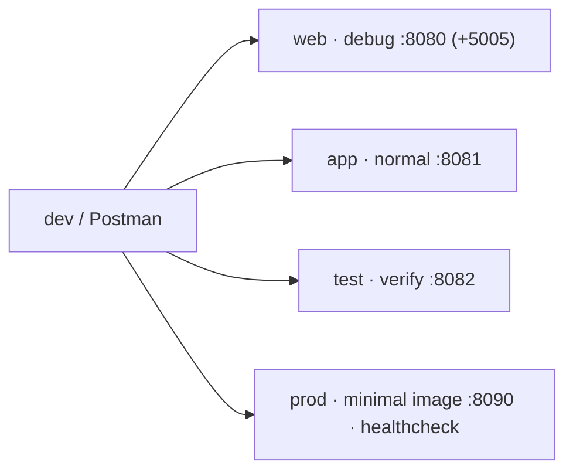

# 🐳 docker

<!-- badges -->


[](README.md)
[](README.en.md)

> 🌐 [Português](README.md) · **English**

Containerization artifacts for **arcanum-leque** (the *Leque de Vagas* backend).

> ℹ️ **No database.** The team chose to simulate persistence with **in-memory
> lists** — for the project's volume (~12 jobs, 5 companies, 6 people) a real DB
> would be over-engineering. This directory only **packages and runs the app**.

---

## 📦 Contents

| File | Purpose | Status |
| ---- | ------- | ------ |
| `Dockerfile` | Multi-stage build: `base → debug → test → builder → production` | ✅ verified |
| `docker-compose.yml` | `web`, `app`, `test`, `prod` services (no database) | ✅ verified |
| `docker-compose.gpu.yml` | **opt-in** NVIDIA GPU overlay — local, **not committed**, used with `-f ... -f ...` | ✅ |
| `.env.example` | Host ports only (`WEB_PORT`, `WEB_DEBUG_PORT`, …) — copy to `.env` | ✅ |

> 🧰 Build tool: **Maven** (via the `./mvnw` wrapper) — team decision.
> Build context = **repo root** (the single `.dockerignore` lives there); the
> Dockerfile copies from `academic/src/`.

### `Dockerfile` stages

| Stage | Purpose |
| ----- | ------- |
| `base` | base image (`eclipse-temurin:21-jdk`), workdir `/app`, cached dependencies |
| `debug` | `base` + diagnostic tools + hot reload; `spring-boot:run` (JDWP only on the `web` service) |
| `test` | `base` + source; runs `mvnw verify` and exits |
| `builder` | `./mvnw -Plight` (AOT, no debug symbols, no DevTools) → Spring Boot layers → **`jlink`** (tailored JRE) |
| `production` | `debian:12-slim` + the `jlink` JRE + app layers, non-root user, `HEALTHCHECK` |

> 🪶 **Lighter Java file:** `builder` runs the `light` profile (less runtime
> reflection, `.class` files without debug info) and `jlink` assembles a runtime
> with only the modules used. The `production` image ends up much smaller than
> one with a full JRE.

---

## 🏗️ Stack architecture



No database service — persistence is an in-memory list. `prod` has a
`healthcheck` every **10s**, **10 retries**.

---

## ▶️ Usage

```bash
cd docker

docker compose up --build web    # dev + hot reload + remote debug on :5005
docker compose up --build app    # "normal" run on :8081
docker compose run --rm test     # runs the tests and exits
docker compose up --build prod   # minimal image (jlink) + healthcheck on :8090
docker compose down -v            # tear everything down + volumes
```

> 🔌 **Port taken?** `cp .env.example .env` and adjust `WEB_PORT`,
> `WEB_DEBUG_PORT`, `APP_PORT`, `TEST_PORT`, `PROD_PORT`. Works without `.env`
> (uses the defaults).

> 🎮 **GPU (neto only):** an **opt-in** overlay, not auto-loaded —
> `docker compose -f docker-compose.yml -f docker-compose.gpu.yml up web`.
> (We avoid the name `docker-compose.override.yml` because it would force
> `driver: nvidia` on every machine, breaking on macOS and GPU-less Linux.)

---

## 🧹 Ignored

- `docker/**/data/` → volume data (see `.gitignore`)
- `.dockerignore` (root, **single**) → only `academic/src/` enters the context;
  within it, `target/`, `*.md` and secrets are cut

## 🗺️ See also

- [`../README.en.md`](../README.en.md) · [`CLAUDE.md`](CLAUDE.md) (PT only)
- [`../.devcontainer/README.en.md`](../.devcontainer/README.en.md)
