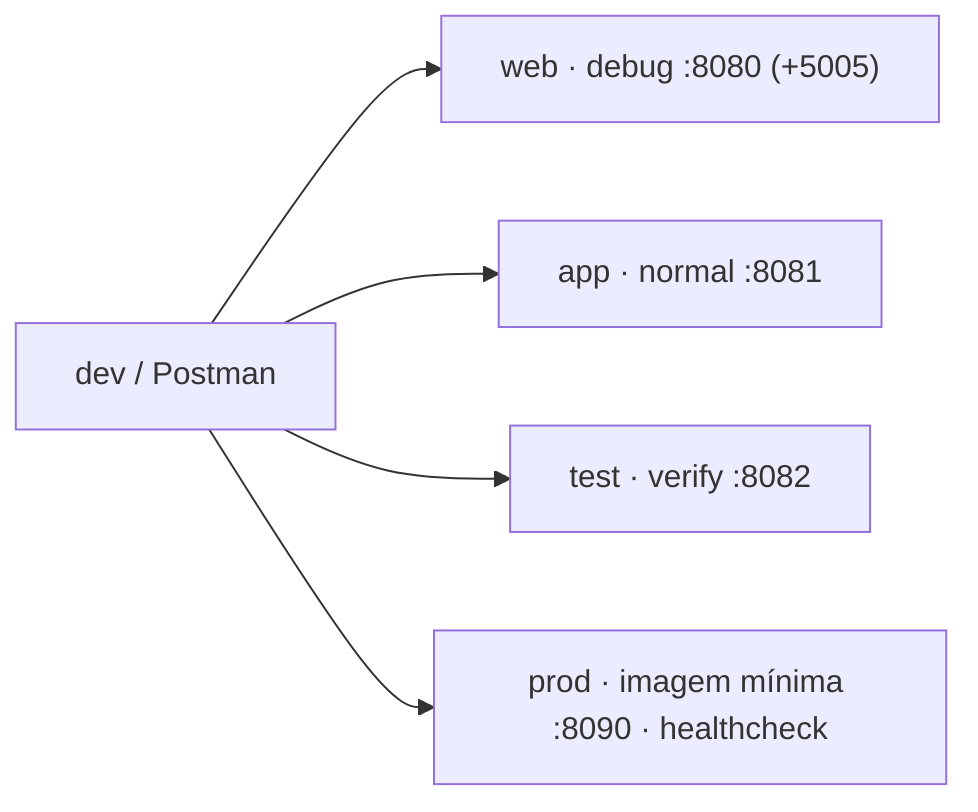

# 🐳 docker

<!-- badges -->


[](README.md)
[](README.en.md)

> 🌐 **Português** · [English](README.en.md)

Artefatos de containerização do **arcanum-leque** (backend do *Leque de Vagas*).

> ℹ️ **Sem banco de dados.** O time decidiu simular a persistência com **listas em
> memória** — para o volume do projeto (~12 vagas, 5 empresas, 6 pessoas) um
> banco real seria over-engineering. Este diretório cuida só de **empacotar e
> subir a aplicação**.

---

## 📦 Conteúdo

| Arquivo | Propósito | Status |
| ------- | --------- | ------ |
| `Dockerfile` | Build multi-stage: `base → debug → test → builder → production` | ✅ validado |
| `docker-compose.yml` | Serviços `web`, `app`, `test`, `prod` (sem banco) | ✅ validado |
| `docker-compose.gpu.yml` | Overlay **opt-in** de GPU NVIDIA — local, **não versionado**, usado com `-f ... -f ...` | ✅ |
| `.env.example` | Só portas do host (`WEB_PORT`, `WEB_DEBUG_PORT`, …) — copie para `.env` | ✅ |

> 🧰 Build tool: **Maven** (via wrapper `./mvnw`) — decisão do time.
> Contexto de build = **raiz do repo** (`.dockerignore` único fica lá); o
> Dockerfile copia de `academic/src/`.

### Estágios do `Dockerfile`

| Estágio | Para quê |
| ------- | -------- |
| `base` | imagem base (`eclipse-temurin:21-jdk`), workdir `/app`, dependências em cache |
| `debug` | `base` + ferramentas de diagnóstico + hot reload; `spring-boot:run` (JDWP só no serviço `web`) |
| `test` | `base` + código; roda `mvnw verify` e sai |
| `builder` | `./mvnw -Plight` (AOT, sem símbolos de debug, sem DevTools) → camadas do Spring Boot → **`jlink`** (JRE sob medida) |
| `production` | `debian:12-slim` + JRE do `jlink` + camadas da app, usuário não-root, `HEALTHCHECK` |

> 🪶 **Arquivo Java mais leve:** `builder` roda o profile `light` (menos
> reflexão em runtime, `.class` sem debug info) e o `jlink` monta um runtime só
> com os módulos usados. A imagem `production` fica bem menor que uma com JRE
> completa.

---

## 🏗️ Arquitetura da stack



Nenhum serviço de banco — persistência é lista em memória. O `prod` tem
`healthcheck` a cada **10s**, **10 tentativas**.

---

## ▶️ Uso

```bash
cd docker

docker compose up --build web    # dev + hot reload + debug remoto em :5005
docker compose up --build app    # execução "normal" em :8081
docker compose run --rm test     # roda os testes e sai
docker compose up --build prod   # imagem mínima (jlink) + healthcheck em :8090
docker compose down -v            # derruba tudo + volumes
```

> 🔌 **Porta ocupada?** `cp .env.example .env` e ajuste `WEB_PORT`,
> `WEB_DEBUG_PORT`, `APP_PORT`, `TEST_PORT`, `PROD_PORT`. Funciona sem `.env`
> (usa os defaults).

> 🎮 **GPU (só neto):** overlay **opt-in**, não é auto-carregado —
> `docker compose -f docker-compose.yml -f docker-compose.gpu.yml up web`.
> (Não usamos o nome `docker-compose.override.yml` porque ele forçaria
> `driver: nvidia` em toda máquina, quebrando no macOS e em Linux sem GPU.)

---

## 🧹 Ignorados

- `docker/**/data/` → dados de volumes (ver `.gitignore`)
- `.dockerignore` (raiz, **único**) → só `academic/src/` entra no contexto; nele,
  corta `target/`, `*.md`, segredos

## 🗺️ Ver também

- [`../README.md`](../README.md) · [`CLAUDE.md`](CLAUDE.md)
- [`../.devcontainer/README.md`](../.devcontainer/README.md)
